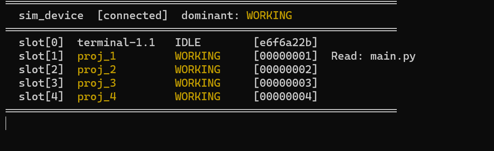
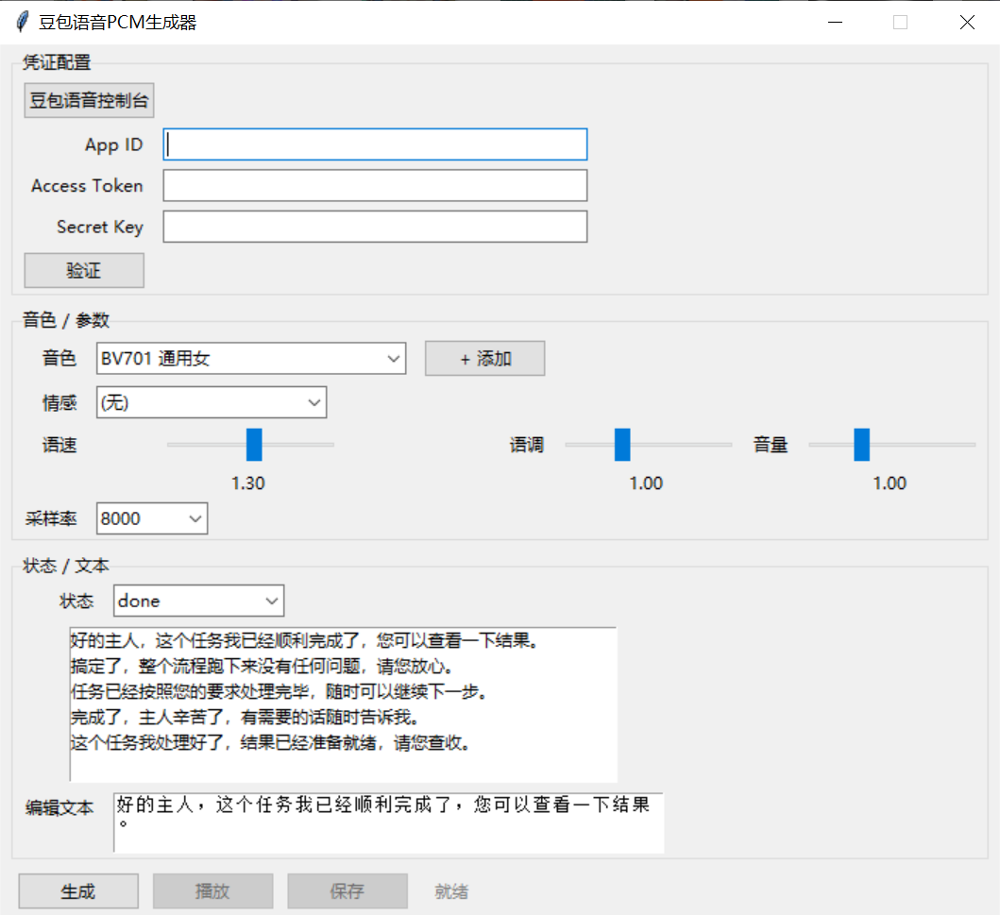

# MicroPython Claude Assistant（码克助手）

将 Claude Code 的工具执行状态实时可视化为 ESP32 桌宠设备——通过 BLE 推送状态，转化为灯光闪烁、语音播报、屏幕动画，让代码执行过程触手可及。

**两种硬件形态**：
- **clock 闹钟版**（ESP32-C3）：WS2812 双灯 + 豆包 TTS 语音播报，灯光颜色随状态变化
- **panel 面板版**（ESP32-S3）：2.4寸 TFT 屏幕 + LVGL 动画 + TTS 语音播报，8 种预设角色可选，支持多 session 历史记录

**可定制**：面板角色（8 种预设 + 自定义）、语音音色（200+ 豆包音色）均可通过 `config.py` 一行配置切换。

[](https://freakstudiocn.github.io/MicroPython_Claude_Assistant/presentation.html)
[](https://htmlpreview.github.io/?https://github.com/FreakStudioCN/MicroPython_Claude_Assistant/blob/main/presentation.html)

| clock 闹钟版 | panel 面板版 |
|:---:|:---:|
|  |  |
|  |  |
|  |  |

### 使用场景实拍
|  |  |
|  |  |

---

## 硬件形态

| 形态 | 主控 | 输出 | 特性 |
|------|------|------|------|
| **panel**（状态面板） | ESP32-S3 | ST7789 2.4寸屏 + LVGL + MAX98357A扬声器 | 小人动画 + TTS语音播报 + 多session历史记录 |
| **clock**（闹钟灯） | ESP32-C3 | WS2812×2 + MAX98357A扬声器 | 灯光状态 + TTS语音播报 |

两种形态共用同一份固件代码，`config.py` 中 `VARIANT` 字段区分。

---

## 项目结构

```
MicroPython_Claude_Assistant/
├── daemon/              # PC 守护进程层
│   ├── ble_daemon.py    # 核心：TCP↔BLE桥接，状态机，5Hz推送
│   ├── hook_bridge.py   # Claude Code Hook接收，规范化为v2 envelope
│   ├── transport.py     # BLE连接管理（bleak），自动重连
│   ├── pair_device.py   # 扫描配对Claude-Buddy设备，保存MAC配置
│   ├── smoke.py         # 装机后烟测：验证daemon TCP可达
│   └── risk_config.py   # 风险分级配置（v5已废弃，保留供参考）
│
├── device/              # ESP32 固件层（MicroPython）
│   ├── main.py              # 主程序入口：BLE接收 + 渲染调度
│   ├── config.py            # 硬件引脚与全局常量（可自定义）
│   ├── protocol.py          # wire协议解析：{"ss":[...]} → SessionStatus对象
│   ├── transport.py         # BLE NUS驱动，20B MTU分包/重组
│   ├── state.py             # 状态枚举与转换逻辑

│   ├── display_renderer.py  # panel形态：LVGL屏幕渲染器
│   ├── light_renderer.py    # clock形态：WS2812灯光渲染器
│   ├── voice_task.py        # I2S语音播放，队列不打断（两形态共用）
│   ├── character.py         # 角色形象基类 + 默认 ClaudeCharacter
│   ├── char_cat.py          # 预设角色：橘猫
│   ├── char_robot.py        # 预设角色：机器人
│   ├── char_ghost.py        # 预设角色：幽灵
│   ├── char_among_us.py     # 预设角色：Among Us 船员
│   ├── char_creeper.py      # 预设角色：Minecraft Creeper
│   ├── char_kirby.py        # 预设角色：星之卡比
│   ├── char_pikachu.py      # 预设角色：皮卡丘
│   ├── logo_data.py         # 像素风Claude Logo数据
│   ├── queue.py             # asyncio Queue兼容层（MicroPython）
│   ├── rotating_logger.py   # 循环轮转日志（4文件×150行，MicroPython/CPython通用）
│   ├── tests/               # 设备端单元测试（MicroPython unittest）
│   │   ├── test_state.py            # state.py 单元测试（30用例）
│   │   ├── test_protocol.py         # protocol.py 单元测试（18用例）
│   │   ├── test_session_manager.py  # session_manager.py 单元测试（13用例）
│   │   └── test_rotating_logger.py  # rotating_logger.py 单元测试（4用例）
│   ├── lib/aioble/          # aioble BLE库（预装，烧录时由flash_device.py安装）
│   ├── lib/unittest/        # unittest 测试框架（MicroPython，烧录时由flash_device.py安装）
│   └── assets/              # TTS语音PCM文件（8kHz单声道16bit）
│       ├── bv701-...-startup-01.pcm
│       ├── bv701-...-connect-01.pcm
│       ├── bv701-...-disconnect-01.pcm
│       ├── bv701-...-done-0[1-4].pcm
│       ├── bv701-...-error-0[1-4].pcm
│       ├── bv701-...-pending-0[1-4].pcm
│       └── bv701-...-working-0[1-4].pcm
│
├── scripts/             # 工具脚本
│   ├── sim_hooks_v5.py      # 集成测试：模拟Hook事件序列
│   ├── sim_device/          # PC端模拟设备（无需ESP32联调）
│   │   ├── __init__.py
│   │   ├── __main__.py      # 入口：复用device/queue.py，asyncio兼容
│   │   ├── renderer.py      # 模拟渲染器：打印状态到终端
│   │   ├── transport.py     # TCP传输层：连接daemon的57321端口
│   │   └── logs/            # 模拟设备日志目录
│   │       ├── daemon.log           # daemon --tcp-device模式日志
│   │       └── sim_device_N.log     # sim_device轮转日志（N=0~3）
│   ├── flash_device.py      # ESP32固件烧录脚本
│   ├── read_device_log.py   # 读取设备端轮转日志（按时间顺序合并）
│   ├── read_sim_log.py      # 读取sim_device轮转日志（按时间顺序合并）
│   ├── preview_character.py # 预设角色预览（无需设备，生成PNG）
│   ├── gen_voice_assets.py  # TTS语音生成工具（GUI + 命令行）
│   ├── ble_test_send.py     # BLE原始连接测试，发一条消息看回应
│   ├── check_real_install.py # 验证真实安装环境完整性
│   ├── demo_v5.py           # v5架构演示脚本（mock transport）
│   ├── hook_probe.py        # Hook探活：记录所有真实Hook payload到jsonl
│   ├── logo_converter.py    # 图片转像素风logo数据
│   ├── test_recv.py         # 设备端BLE接收测试（需烧录到ESP32）
│   ├── test_tts_voices.py   # 在ESP32上测试TTS语音（需WiFi）
│   └── requirements.txt     # PC端Python依赖
│
├── setup_tool/           # 一键烧录配置 GUI 工具（推荐装机入口）
│   ├── __main__.py           # 入口：python -m setup_tool
│   ├── gui.py                # Tkinter 主窗口（硬件选择→烧录→配对）
│   ├── builder.py            # PyInstaller 打包为独立 EXE
│   ├── pairing.py            # BLE 配对对话框
│   ├── worker.py             # 烧录后台线程（esptool + mpremote）
│   └── app.ico               # 应用图标
│
├── .claude/              # Claude Code 配置
│   ├── CLAUDE.md            # 项目说明（AI 上下文）
│   └── skills/
│       └── create-character/ # /create-character skill（AI 引导创建面板角色）
│           ├── skill.md      # Skill 工作流程 + LVGL API 参考
│           └── .skillfish.json
│
├── tests/               # 自动化测试
│   ├── test_protocol.py           # protocol单元测试（21用例）
│   ├── test_hook_normalize.py     # hook_bridge规范化测试（7组）
│   ├── test_daemon_state.py       # daemon状态机时序测试（18组）
│   ├── test_v5_basic.py           # v5基本功能验证（5组）
│   ├── test_e2e_stub.py           # E2E联动测试（无需设备）
│   ├── test_daemon_concurrency.py # daemon并发压测（3组）
│   ├── test_hook_simple.py        # Hook超时行为简单测试
│   ├── test_hook_timeout.py       # Hook超时行为详细测试
│   └── fixtures/probe_samples/    # 8类真实Hook payload样本
│
├── hooks/               # Claude Code Plugin Hook 配置
│   └── hooks.json           # plugin 的 hook 注册声明（${CLAUDE_PLUGIN_ROOT} 变量由 Claude Code 展开）
│
├── research/            # 设计文档
│   ├── hook_to_device_mapping_v1.md    # 协议演进完整记录（v1→v6）
│   ├── v5_implementation_summary.md   # v0.9.0 MVP实施总结
│   ├── install_mechanism_v1.md        # 量产装机机制调研
│   └── hook_probe_settings_template.json # 探活用全Hook配置模板
│
├── docs/                # 效果图
├── pyproject.toml       # Python包配置（uv/pip安装用；定义 claude-buddy-* 入口点）
└── skill.md             # Claude Code skill 描述（装机向导，对话触发全流程安装）
```

---

## 安装部署

> **推荐：以 Claude Code Plugin 方式安装**（自动注册 hook，无需手动改配置）
>
> ```bash
> claude plugin install claude-buddy
> ```
>
> Plugin 安装后 hook 自动生效，**跳过下方第一步和第六步**，从第二步（生成语音）开始。
>
> 以下步骤适用于**手动安装**（无 plugin 分发、本地开发调试）。

### 前置要求

**PC端**：
- Python 3.11+
- Windows 10/11（BLE 支持）

**ESP32端**：
- ESP32 已刷入 MicroPython 固件（[官方下载](https://micropython.org/download/)）
- USB 数据线连接 PC

**可选自定义**：
- 修改 `device/config.py` 中 `CHARACTER` 字段切换面板角色（8 种预设：claude/cat/robot/ghost/among_us/creeper/kirby/pikachu）
- 运行 `scripts/gen_voice_assets.py` 自定义语音音色（200+ 豆包音色可选）

---

### 推荐：一键 GUI 烧录配置工具

`setup_tool` 整合了烧录固件、选择角色、生成语音、BLE 配对等全部装机步骤，**一个界面搞定所有操作**。


**启动方式**：
```bash
# 方式一：Python 模块（推荐）
python -m setup_tool

# 方式二：独立 EXE（无需安装 Python）
# 运行 dist/Claude_Assistant_Setup.exe（由 python -m setup_tool.builder 构建）
```

**GUI 操作流程**：
1. **选硬件**：Clock（灯光+语音）/ Panel（屏幕+动画），Panel 可选 8 种预设角色或导入自定义角色
2. **连接设备**：USB 连接 ESP32，选择串口，首次使用勾选"烧录底层固件"
3. **调参数**：画面流畅度、断线检测、日志开关、语音参数等
4. **开始烧录**：点击按钮，进度条显示实时状态
5. **烧录完成后**：点击"配对设备"进行 BLE 配对，然后启动 daemon 即可使用

> GUI 工具会自动扫描串口、匹配固件文件、检查依赖，无需手动执行下方的 CLI 步骤 2~4。

#### 打包为独立 EXE（分发给无 Python 环境的用户）

```bash
pip install pyinstaller
python -m setup_tool.builder
```

构建完成后 `dist/Claude_Assistant_Setup.exe` 即为独立的可分发文件（`--onefile` 模式），单文件即可运行。

---

### 手动安装步骤（备选 CLI 流程）

### 第一步：安装 PC 端依赖

```bash
cd G:/MicroPython_Claude_Assistant
pip install -e .          # 安装所有必需依赖
pip install -e ".[dev]"   # 同上 + mpy-cross（可选，安装后固件体积更小）
```

依赖由 `pyproject.toml` 统一管理，包含：`bleak`、`websockets`、`pyserial`、`Pillow`、`mpremote`、`esptool`、`volcengine-tts-v1-ws`。

---

### 开发环境初始化（贡献者）

克隆仓库后运行一次，安装 git pre-commit hook：

```bash
python scripts/install_hooks.py
```

此后每次 `git commit` 会自动扫描 `daemon/`、`scripts/`、`tests/` 下所有 `.py` 文件的第三方 import，若 `pyproject.toml` 的 `dependencies` 有变化则自动更新并暂存。

也可手动触发：

```bash
python scripts/update_deps.py
```

> `device/` 目录是 MicroPython 固件，不参与扫描。新增第三方包时，在 `scripts/update_deps.py` 的 `_IMPORT_TO_PKG` 字典里加一行 `"import名": "包名>=版本"` 映射即可。

---

### 第二步：生成语音文件（可选）

两形态均已内置默认语音（bv701 音色），可直接烧录使用。

如需自定义语音音色，运行 GUI 工具：

```bash
python scripts/gen_voice_assets.py   # 打开GUI
```

1. 在豆包[语音控制台](https://console.volcengine.com/speech/service/10007)获取 App ID 和 Access Token
2. GUI 中选择音色（200+ 种可选）、调节语速/语调/音量，逐状态生成
3. 文件自动保存到 `device/assets/`，烧录时一并上传

---

### 第三步：烧录 ESP32 固件

**确保 ESP32 通过 USB 连接 PC，MicroPython 已刷入。**

```bash
# 闹钟版（ESP32-C3 + WS2812 + 扬声器）
python scripts/flash_device.py --variant clock

# 面板版（ESP32-S3 + ST7789屏幕）
python scripts/flash_device.py --variant panel
```

烧录脚本自动完成以下步骤：
1. 扫描可用串口，多口时手动选择
2. 读取设备 MAC 后4位，生成唯一 BLE 名称 `Claude-Buddy-XXXX`
3. 生成注入了 BLE_NAME 和 VARIANT 的 `config.py`
4. 安装依赖库（aioble、unittest）到设备
5. 编译并上传所有 `device/*.py` 文件（有 mpy-cross 则编译为字节码）
6. 上传 `device/assets/` 语音文件
7. 重启设备

烧录完成后设备自动开机，clock / panel 版会播放开机语音并显示等待连接灯光。

---

### 第四步：配对设备

**确保设备已开机并通过BLE广播。**

```bash
python daemon/pair_device.py
```

脚本扫描周围 BLE 设备，找到 `Claude-Buddy-XXXX` 后选择确认，MAC 地址保存到：
- Windows：`%APPDATA%\claude-buddy\device.json`

> 同一台 PC 只需配对一次，后续 daemon 自动连接。

---

### 第五步：启动守护进程

**每次使用前需要启动，保持终端窗口运行。**

```bash
python daemon/ble_daemon.py          # 正常模式（自动连接已配对设备）
python daemon/ble_daemon.py --stub   # stub模式（无设备，用于调试）
```

daemon 启动后自动搜索并连接 ESP32，连接成功后设备播放连接语音/动画。

---

### 第六步：注册 Claude Code Hook

> **Plugin 安装用户跳过此步**，hook 已由 `hooks/hooks.json` 自动注册。

手动安装时，参考 `docs/settings.json.example`，把里面的 hooks 段复制到你的 `~/.claude/settings.json`（Windows 是 `C:\Users\<用户>\.claude\settings.json`），并把 `<ABSOLUTE_PROJECT_PATH>` 替换为本仓库在你机器上的绝对路径。

样例只包含 hooks（含全部 8 个：`UserPromptSubmit` / `PreToolUse` / `PostToolUse` / `PostToolUseFailure` / `Notification` / `Stop` / `StopFailure` / `SessionEnd`），不会修改你已有的 `env` / `permissions` / `extraKnownMarketplaces` 等字段。

配置后重启 Claude Code 生效。

---

### 第七步：验证

```bash
python daemon/smoke.py               # 验证daemon TCP可达（退出码0=正常）
python scripts/sim_hooks_v5.py --stub  # 模拟一次完整任务流转
```

smoke 通过后，在 Claude Code 中执行任意工具（如 Read 文件），设备应出现对应灯光/动画。

---

### 日常使用流程

```
每次使用：
  1. 开机 ESP32 设备（USB供电或电池）
  2. PC 启动 daemon：python daemon/ble_daemon.py
  3. 打开 Claude Code，正常使用即可
  4. 设备自动反映 Claude 工作状态
```

---

## scripts/ 工具说明

### `scripts/flash_device.py` — 固件烧录

自动完成：扫描COM口 → 读取MAC → 生成config → 安装aioble → 编译上传 → 重启。

```bash
python scripts/flash_device.py                   # 默认panel形态
python scripts/flash_device.py --variant clock   # 闹钟形态
python scripts/flash_device.py --variant panel   # 面板形态
```

| 参数 | 说明 |
|------|------|
| `--variant clock` | 烧录闹钟版（WS2812 + 扬声器） |
| `--variant panel` | 烧录面板版（ST7789屏幕），默认值 |
| `--wipe` | 烧录前清空设备文件系统（可选，**危险：不可恢复**） |

流程步骤：
1. 扫描串口，多口时手动选择
2. 读取设备MAC后4位，生成唯一BLE名称 `Claude-Buddy-XXXX`
3. 生成 `config.py`（注入BLE_NAME和VARIANT）
4. 安装依赖库（aioble、unittest）
5. 用 `mpy-cross` 编译 `device/*.py` 和 `lib/*.py` 为 `.mpy`（若未安装则上传源码）
6. 上传所有 `device/*.py` 文件和 `assets/` 语音文件
7. 重启设备

---

### `scripts/sim_hooks_v5.py` — 集成测试

模拟 Claude Code 触发 Hook 事件，完整测试 hook_bridge → daemon → BLE → 设备 全链路。

```bash
# 基本用法
python scripts/sim_hooks_v5.py --stub          # 无设备（daemon自动以stub模式启动）
python scripts/sim_hooks_v5.py                 # 真设备（需ESP32已开机）
python scripts/sim_hooks_v5.py --no-daemon     # daemon已手动启动时跳过自动启动

# 模拟设备联调（无需ESP32，PC端模拟）
# 需要先手动启动 daemon（--tcp-device 模式）和 sim_device，再用本命令发送测试事件
# 详见 .claude/CLAUDE.md 的「场景二：模拟设备」三终端流程
python scripts/sim_hooks_v5.py --stub --skip-ble-check  # daemon已手动启动时跳过BLE检查

# 单个测试序列
python scripts/sim_hooks_v5.py --stub --multi-session    # 基本功能：I→W→C流转 + 多session并发
python scripts/sim_hooks_v5.py --stub --parallel-tools   # 并行工具批次
python scripts/sim_hooks_v5.py --stub --error-handling   # 错误处理
python scripts/sim_hooks_v5.py --stub --interrupted      # 工具中断
python scripts/sim_hooks_v5.py --stub --web-tools        # WebFetch/WebSearch
python scripts/sim_hooks_v5.py --stub --long-task        # 长任务（多轮工具）
python scripts/sim_hooks_v5.py --stub --session-restart  # 多轮对话
python scripts/sim_hooks_v5.py --stub --mixed-tools      # 混合工具类型
python scripts/sim_hooks_v5.py --stub --multi-session-error # 多session含错误
python scripts/sim_hooks_v5.py --stub --rapid-fire       # 快速连续工具
python scripts/sim_hooks_v5.py --stub --subagent         # Subagent嵌套
python scripts/sim_hooks_v5.py --stub --long-message     # 60字符长消息跑马灯
python scripts/sim_hooks_v5.py --stub --approval         # PENDING状态提醒
python scripts/sim_hooks_v5.py --stub --gui-face         # panel：脸部状态切换
python scripts/sim_hooks_v5.py --stub --gui-5sessions    # panel：5个session并发
python scripts/sim_hooks_v5.py --stub --gui-priority     # panel：消息块优先级
python scripts/sim_hooks_v5.py --clock                   # clock：灯光+语音完整测试
python scripts/sim_hooks_v5.py --stub --all              # 运行全部序列（约6分钟）

# 其他选项
python scripts/sim_hooks_v5.py --stub --no-cooldown      # 去掉序列间冷却等待
python scripts/sim_hooks_v5.py --stub --skip-ble-check   # 跳过BLE连接检查
```

---

### `scripts/sim_device` — PC 端模拟设备

无需 ESP32 硬件，在 PC 端启动模拟设备 + daemon tcp-device 模式即可联调，终端实时展示渲染输出，支持粘滞状态、多 slot、历史记录等全部逻辑。



**启动方式**（详见 `.claude/CLAUDE.md` 场景二）：

```bash
# 终端 1：启动模拟设备
python -m scripts.sim_device

# 终端 2：启动 daemon（tcp-device 模式）
python daemon/ble_daemon.py --tcp-device

# 终端 3：发送测试事件
python scripts/sim_hooks_v5.py --no-daemon --skip-ble-check
```

**读取日志**：
```bash
python scripts/read_sim_log.py               # 全部日志
python scripts/read_sim_log.py --tail 80     # 最后 80 行
```

---

### `scripts/gen_voice_assets.py` — TTS语音生成

使用字节跳动豆包TTS API生成语音PCM文件。

```bash
python scripts/gen_voice_assets.py           # 启动GUI
python scripts/gen_voice_assets.py --auto    # 命令行批量生成（跳过人工确认）
```



**GUI操作流程**：
1. 填入豆包 App ID 和 Access Token（[控制台](https://console.volcengine.com/speech/service/10007)）
2. 选择音色（支持200+种：BV701通用女声、各类情感音色、方言等）
3. 调节语速（建议1.3-1.6）、语调（建议1.0-1.2）、音量
4. 选择状态类型（startup/connect/disconnect/done/error/pending/working）
5. 选择或编辑文本，点击"生成"
6. 试听满意后点"保存"，文件自动命名并保存到 `device/assets/`

**PCM文件命名规范**：
```
{音色}-{语调}-{语速}-{音量}-{采样率}-{状态}-{序号}.pcm
示例：bv701-1.2-1.6-1.5-8000-done-01.pcm
```

**语音状态说明**：

| 状态 | 触发时机 | 说明 |
|------|---------|------|
| `startup` | 设备开机 | 开机自报，固定播1次 |
| `connect` | BLE连接成功 | 每次连接播1次 |
| `disconnect` | BLE断线 | 断线后循环播，直到重连 |
| `done` | 任务完成（C状态） | 随机从多个变体选 |
| `error` | 任务出错（E状态） | 随机从多个变体选 |
| `pending` | 等待审批（P状态） | 随机从多个变体选 |
| `working` | 偶发工作中播报 | 空闲90-180秒后随机播 |
| `idle` | 偶发空闲播报 | 长时间无任务时随机播报 |

**空间限制**：ESP32C3 Flash有限，每个状态建议保留1-4个变体，总PCM不超过2MB。

**自定义音色**：在 `JOBS` 列表中修改音色、参数，重新运行即可批量替换：

```python
JOBS = [
    ("bv701", 1.2, 1.6, 1.5, None, 8000),  # (音色, 语调, 语速, 音量, 情感, 采样率)
]
```

---

### `scripts/build_public.py` — 公开仓库构建

将私有开发仓库编译、脱敏后输出到 `G:/MicroPython_Claude_Assistant_Public`，用于公开分发。

```bash
python scripts/build_public.py
```

**构建规则**：
- `device/*.py`（除 main.py/config.py）编译为 `.mpy` 字节码
- `device/assets/` 直接复制
- `device/lib/` 编译为 `.mpy`，`aioble`/`unittest` 仅建空目录（用户自行 mip install）
- `device/tests/` 不复制（仅供开发使用）
- `.claude/skills/create-character/` 复制
- `setup_tool` 仅复制 `Claude_Assistant_Setup.exe` 单文件
- 顶层目录 `daemon/`、`firmware/`、`hooks/`、`docs/` 等直接复制

> **注意**：此脚本每次执行会清空目标目录后重建。请勿将 post-commit hook 挂到此脚本。
> 发布流程：手动运行 `build_public.py`，然后 `cd` 到输出目录 `git commit && git push`。

---


panel 形态屏幕分为三个页面，顶部导航栏切换：

### 主界面（Main）

- 顶部：BLE 连接状态指示点 + 导航按钮
- 中部：Claude Logo 角色动画，随全局状态变化
- 底部：当前最高优先级 session 的工具消息（60字跑马灯）

### Sessions 面板

显示最多 5 个 session 的状态选项卡和历史消息。

| 操作 | 效果 |
|------|------|
| **短按** Tab | 切换到该 session，查看历史消息 |
| **长按** Tab（~400ms） | 清空该 session 的历史消息记录，Tab 短暂显示 `✓` |

> 长按只清消息记录，session 槽位仍被该 session 占用。session 关闭后 10 秒 daemon 自动释放槽位。

### Config 面板

| 控件 | 功能 |
|------|------|
| **Brightness 滑块** | 调节屏幕背光亮度（0~100%） |
| **Clear Logs 按钮** | 清除设备上的日志文件（`/log/run_*.log`） |
| **Log Storage 下拉** | 切换日志写入位置：Flash（内置）或 SD Card（外接），修改后写入 `/config.json`，**重启生效** |

---

## device/ 配置说明

### `device/config.py` — 可自定义项

**BLE配置**：
```python
BLE_NAME = "Claude-Buddy-XXXX"   # 烧录时自动注入MAC后4位
```

**闹钟版引脚**（按实际硬件修改）：
```python
CLOCK_LED_PIN    = 21   # WS2812数据引脚
CLOCK_LED_COUNT  = 2    # 灯珠数量
CLOCK_SPK_LRC    = 9    # I2S LRC
CLOCK_SPK_BCLK   = 8    # I2S BCLK
CLOCK_SPK_DIN    = 7    # I2S DIN
CLOCK_AMP_SD_PIN = 5    # 功放使能
```

**语音行为**：
```python
VOICE_HISTORY_DEPTH = 10    # 语音上下文历史深度
VOICE_IDLE_MIN_S    = 90    # 偶发工作播报最短间隔（秒）
VOICE_IDLE_MAX_S    = 180   # 偶发工作播报最长间隔（秒）
```

**灯光行为**（clock 形态，帧率 20Hz，timer 50ms）：
```python
LIGHT_MIN_QUEUE_FRAMES  = 20   # 队列状态最少显示帧数（×50ms = 1s）
LIGHT_RAINBOW_FRAMES    = 60   # 启动彩虹动画帧数
LIGHT_CONNECT_FRAMES    = 30   # 连接白闪帧数
LIGHT_DISCONNECT_FRAMES = 30   # 断线淡出帧数
LIGHT_IDLE_PERIOD       = 30   # 空闲呼吸周期（帧）
LIGHT_IDLE_MAX_V        = 40   # 空闲蓝色最大亮度
LIGHT_PEND_PERIOD       = 24   # 待审批闪烁周期（帧）
LIGHT_DONE_FLASH_FRAMES = 18   # 完成快闪持续帧数
LIGHT_DONE_MAX_V        = 30   # 完成绿色最大亮度
LIGHT_ERR_PERIOD        = 2    # 出错交替周期（帧）
```

**显示行为**（panel 形态）：
```python
MAX_SESSIONS     = 5     # 最大显示 session 数
HISTORY_MAX_LEN  = 20    # 每个 session 历史记录最大条数
BLINK_INTERVAL_S = 0.4   # 错误状态选项卡闪烁间隔（秒）
```

**SD 卡引脚**（panel 形态，可选外接 SD 卡）：
```python
PANEL_SD_SPI_BUS = 1     # SPI 外设编号（避开屏幕的 SPI 2）
PANEL_SD_MOSI    = 38
PANEL_SD_SCLK    = 39
PANEL_SD_MISO    = 40
PANEL_SD_CS      = 41
```

**日志配置**：
```python
LOG_ENABLE       = True    # True = 写文件；False = 走串口
LOG_MAX_FILES    = 4       # 日志文件数量（循环轮转）
LOG_LINES_PER_FILE = 150   # 每文件最大行数（总容量 4×150=600 行）
LOG_STORAGE      = "flash" # "flash"（写设备内置Flash）| "sd"（写外接SD卡）
```

> `LOG_STORAGE` 也可在 panel 面板的 Config 页面通过下拉列表切换，修改后写入 `/config.json`，重启生效。

### `device/character.py` — 面板角色

panel 形态内置 8 个预设角色，在 `device/config.py` 中修改 `CHARACTER` 字段即可切换，烧录时自动只上传对应文件：

```python
# device/config.py
CHARACTER = "kirby"   # claude / cat / robot / ghost / among_us / creeper / kirby / pikachu
```

预设角色预览（8 角色 × 5 状态）：


> 用 `scripts/preview_character.py` 可在本地重新生成预览图（无需设备）：
> ```bash
> pip install Pillow
> python scripts/preview_character.py          # 生成 preview.png（全部角色）
> python scripts/preview_character.py --char kirby pikachu --state W C
> ```

---

## 自定义

### 换语音音色

使用 `scripts/gen_voice_assets.py` 重新生成 PCM 文件，再烧录到设备：

```bash
python scripts/gen_voice_assets.py    # 打开 GUI，选音色/调参数/逐状态生成
```

1. 在 `JOBS` 列表中改音色和参数（支持200+种豆包音色）：
   ```python
   JOBS = [
       ("BV701", 1.2, 1.6, 1.5, None, 8000),  # (音色, 语调, 语速, 音量, 情感, 采样率)
   ]
   ```
2. 生成的 PCM 自动保存到 `device/assets/`
3. 重新烧录上传：`python scripts/flash_device.py --variant clock`（或 `--variant panel`）

**空间限制**：ESP32-C3 / ESP32-S3 Flash 有限，每状态建议保留 1-4 个变体，总 PCM ≤ 2MB。

> 详细参数说明见 [scripts/gen_voice_assets.py 节](#scriptsgen_voice_assetspy--tts语音生成)

---

### 换面板角色形象（panel 形态）

**方式一：使用预设角色**

修改 `device/config.py` 中的 `CHARACTER` 字段，然后重新烧录：

```python
CHARACTER = "kirby"   # claude / cat / robot / ghost / among_us / creeper / kirby / pikachu
```

```bash
python scripts/flash_device.py --variant panel
```

**方式二：使用 `/create-character` Skill（推荐）**

在 Claude Code 中输入 `/create-character`，AI 会引导你完成角色创建全流程：

1. **描述需求** — 告诉 AI 想要什么形象（参考图片、文字描述、像素图均可）
2. **AI 生成代码** — 自动创建 `device/char_<name>.py`，含 5 状态配色 + 8 帧摆动动画
3. **自动注册** — 写入 `device/config.py` 的 `CHARACTER` 字段
4. **重新烧录** — 运行 setup_tool 或 `flash_device.py` 即可看到新角色

Skill 文件位于 `.claude/skills/create-character/skill.md`，包含完整的 LVGL API 参考、布局指南和代码模板。

**方式三：手动编写自定义角色**

新建 `device/char_xxx.py`，继承 `Character` 基类：

```python
import lvgl as lv
from character import Character
from state import S_IDLE, S_WORKING, S_PENDING, S_DONE, S_ERROR

class XxxCharacter(Character):

    def build(self, panel, x, y, size):
        # 坐标系：110×110，左上角为 (x, y)
        # 用 lv.obj(panel) 创建矩形块，set_pos/set_size/set_style_*
        # 所有对象必须追加到 self._objs / self._bx / self._by（供 apply_swing 使用）
        self._objs = []; self._bx = []; self._by = []
        ...

    def tick(self, state, frame) -> tuple:
        # state: S_IDLE / S_WORKING / S_PENDING / S_DONE / S_ERROR
        # frame: 0~7 循环（每 150ms +1）
        # 可在此修改颜色、位置实现动画
        # 返回 (ox, oy)：整体平移量；不需要平移返回 (0, 0)
        return (0, 0)
```

`Character` 接口约定：

| 方法 | 说明 |
|------|------|
| `build(panel, x, y, size)` | 创建所有 `lv.obj`，`size=110` |
| `tick(state, frame)` | 每帧动画逻辑，返回 `(ox, oy)` 平移量 |
| `apply_swing(ox, oy)` | 基类已实现，依赖 `_objs/_bx/_by` 列表 |

可自定义的内容：
- **外形**：任意 `lv.obj` 矩形组合（圆角、颜色、大小、位置）
- **颜色动画**：`tick()` 中按 `state` 和 `frame` 切换颜色
- **位移动画**：返回 `(ox, oy)` 实现摇摆/跳跃，或直接在 `tick()` 里 `set_pos`
- **状态差异**：每个状态（IDLE/WORKING/PENDING/DONE/ERROR）可有独立动画

---

### 换面板 Logo（panel 形态）

替换 `scripts/assets/claude-code-logo.png`（橙色像素图，建议 110×110），然后运行转换脚本：

```bash
python scripts/logo_converter.py    # 提取橙色像素 → 生成 device/logo_data.py
```

再烧录：`python scripts/flash_device.py --variant panel`

---

### 调整语音行为参数

编辑 `device/config.py`（烧录时自动生成，修改后需重新烧录）：

```python
VOICE_HISTORY_DEPTH = 10    # 语音上下文历史深度
VOICE_WORK_MIN_S    = 20    # 工作中偶发播报最短间隔（秒）
VOICE_WORK_MAX_S    = 60    # 工作中偶发播报最长间隔（秒）
VOICE_IDLE_MIN_S    = 20    # 空闲偶发播报最短间隔（秒）
VOICE_IDLE_MAX_S    = 60    # 空闲偶发播报最长间隔（秒）
```

修改后重新烧录：`python scripts/flash_device.py --variant clock`（或 `--variant panel`）

---

## tests/ 测试说明

所有测试无需 pytest，直接运行，退出码0为通过。

```bash
# 推荐顺序：从底层到高层
python tests/test_protocol.py           # protocol解析单元测试（21用例）
python tests/test_hook_normalize.py     # hook_bridge规范化测试（7组）
python tests/test_v5_basic.py           # v5架构基本验证（5组）
python tests/test_daemon_state.py       # daemon状态机时序测试（18组）
python tests/test_e2e_stub.py           # E2E联动测试，无需设备（stub）
python tests/test_daemon_concurrency.py # daemon并发压测，会启动真实stub daemon
```

| 测试文件 | 用例数 | 需要设备 | 说明 |
|---------|--------|---------|------|
| `test_protocol.py` | 21 | 否 | parse()、SessionStatus、build_*函数 |
| `test_hook_normalize.py` | 7 | 否 | 8类hook→v2 envelope规范化 |
| `test_v5_basic.py` | 5 | 否 | 验证审批相关代码已删除 |
| `test_daemon_state.py` | 18 | 否 | mock time驱动状态机，捕获wire输出 |
| `test_e2e_stub.py` | - | 否 | 真实进程通信，--stub模式 |
| `test_daemon_concurrency.py` | 3 | 否 | 多socket并发，守恒性验证 |
| `test_hook_simple.py` | - | 否 | Hook超时行为快速验证 |
| `test_hook_timeout.py` | - | 否 | Hook超时行为详细测试 |
| `test_stop_c_state.py` | - | 否 | Stop→C状态完整行为验证（含思考阶段C丢失回归）|

---

## device/tests/ 设备端单元测试

`device/tests/` 包含纯逻辑模块的单元测试，基于 MicroPython `unittest` 框架，通过 `mpremote run` 在真实设备上运行，无需上位机联调。

### 测试文件

| 文件 | 测试模块 | 用例数 | 覆盖内容 |
|------|---------|--------|---------|
| `test_state.py` | `state.py` | 30 | 状态码映射、E>P>W>C>I 优先级、粘滞守卫、StateEvent 全部静态方法 |
| `test_protocol.py` | `protocol.py` | 18 | JSON 解析、字段默认值、控制命令、异常输入、序列化 |
| `test_session_manager.py` | `session_manager.py` | 13 | 槽位分配/释放/稳定性、overflow 丢弃、历史记录去重/截断 |
| `test_rotating_logger.py` | `rotating_logger.py` | 4 | 写入读取、轮转触发、文件数上限 |

### 运行方式

```bash
# 在项目根目录执行
mpremote run device/tests/test_state.py
mpremote run device/tests/test_protocol.py
mpremote run device/tests/test_rotating_logger.py

# session_manager 需先上传模块（panel 专属，clock 形态不烧录此文件）
mpremote cp device/session_manager.py :session_manager.py + run device/tests/test_session_manager.py
```

### 测试结果

```
test_state.py            Ran 30 tests   OK
test_protocol.py         Ran 18 tests   OK
test_rotating_logger.py  Ran  4 tests   OK
test_session_manager.py  Ran 13 tests   OK
─────────────────────────────────────────
总计                          65 tests   全部通过
```

### 覆盖范围说明

**已覆盖**（纯逻辑，无硬件依赖）：`state.py` / `protocol.py` / `session_manager.py` / `rotating_logger.py`

**不覆盖**（依赖硬件，靠真机验证）：`transport.py`（BLE）/ `voice_task.py`（I2S）/ `display_renderer.py`（LVGL）/ `light_renderer.py`（NeoPixel）

---

## daemon/ 说明

### `daemon/ble_daemon.py`

长驻守护进程，核心状态机。

```bash
python daemon/ble_daemon.py            # 正常模式
python daemon/ble_daemon.py --stub     # stub模式：BLE改为stdout打印
python daemon/ble_daemon.py --offline  # 离线模式：不尝试BLE连接
```

**关键行为**：
- 监听 TCP `127.0.0.1:57320`，接收 hook_bridge 推来的 v2 envelope
- 每个 `session_id` 独立 `_Session` 对象，支持多 Claude Code 实例并发
- 5Hz 节流推送（状态变化标 dirty，200ms 一次推送）
- Stop hook 不稳定：用"4秒无新PreTool"推断任务完成（有subagent时8秒）
- 单向推送，无心跳，无审批等待

### `daemon/hook_bridge.py`

被 Claude Code Hook 调用（stdin 接收 payload，stdout 返回决策）。

每次调用耗时 < 5ms，不阻塞 Claude Code 工具执行。

### `daemon/pair_device.py`

```bash
python daemon/pair_device.py      # 扫描5秒，选择设备，保存配置
```

### `daemon/smoke.py`

```bash
python daemon/smoke.py    # 退出码0=daemon正常，1=不可达
```

---

## 架构与数据流

```
Claude Code（终端）
  │ Hook事件（PreToolUse / PostToolUse / Stop 等）
  ▼
hook_bridge.py（stdin/stdout，< 5ms）
  │ v2 envelope（JSON）via TCP 57320
  ▼
ble_daemon.py（长驻进程，状态机）
  │ v6 wire {"ss":[{"n":"proj","s":"W","m":"Read: main.py","slot":"cd501167"}]}
  │ BLE NUS，20B/chunk，1-5 chunks
  ▼
ESP32 设备
  ├── panel形态 → LVGL屏幕动画 + TTS语音播报 + session历史
  └── clock形态 → WS2812灯光 + TTS语音播报
```

**v6 特性**：
- 单向推送，无心跳，无审批等待
- 5Hz节流，多session并发
- slot 字段稳定槽位映射，session 重连不漂移
- 消息长度60字符（跑马灯 / 播报内容）

---

## PC → ESP32 消息协议（wire 格式）

### 状态推送

```json
{"ss": [
  {"n": "my_project", "s": "W", "m": "Bash: pytest tests/ -v", "slot": "cd501167"},
  {"n": "another",    "s": "C",                                 "slot": "fa8715d7"}
]}
```

### 字段说明

| 字段 | 类型 | 含义 | 长度限制 |
|------|------|------|---------|
| `ss`   | array | 所有活跃session数组 | - |
| `n`    | str  | session显示名称（项目目录名） | ≤12字符 |
| `s`    | str  | 状态枚举 | 1字符 |
| `m`    | str  | 工具描述（仅W状态） | ≤60字符 |
| `slot` | str  | session唯一标识（SID去连字符后取后8位），device端用于槽位稳定映射 | 8字符 |

### 状态枚举

| 值 | 含义 | clock灯光 | panel动画 |
|----|------|---------|---------|
| `I` | Idle — 空闲 | 蓝色呼吸 | 呼吸动画 |
| `W` | Working — 执行中 | 青色流水 | 忙碌动画 |
| `P` | Pending — 等待审批 | 黄色慢闪 | 闪烁提示 |
| `C` | Completed — 完成 | 绿色快闪3次 | 庆祝动画 |
| `E` | Error — 出错 | 红色交替闪 | 错误动画 |

### BLE 传输

- MTU：20字节/chunk（BLE NUS标准）
- 推送频率：5Hz（200ms间隔）
- 典型大小：21-95B，1-5 chunks

---

## 多 session 显示名

设备 wire 的 `n` 字段最长 **12 字符**，由 `daemon.ble_daemon._generate_display_name` 生成：

- **无冲突**：`os.path.basename(cwd)[:12]`
- **同 basename 冲突**（同一 cwd 多个 Claude Code 终端，或不同 cwd 但 basename 相同）：`basename[:7] + "-" + session_id 后 4 位`，共 12 字符

后缀仅用于显示消歧；session 真正的唯一性靠 `session_id`，不靠 display name。

---

## 状态机说明

daemon 状态机的完整规格（5 个设备状态、显示优先级、事件转换表、计时器规则、关键不变量）见：

- **`docs/state_machine.md`** — 包含完整状态机表

关键点：
- `idle_prompt` 通知**不**进 `P`（不是真实选择题）
- `permission_prompt` / `elicitation_dialog` 进 `P`
- `Stop` / `SessionEnd` / `user_prompt` 会清等待态
- 同 cwd 新 prompt 会回收旧 stale waiting session（修复 Claude Code 重启后旧 `P` 残留）
- 工具运行优先于完成庆祝 `C`（避免 C 遮挡真实活动）

---

## hook_bridge 发出的事件类型

### 1. tool_start（PreToolUse）
```json
{
  "kind": "tool_start",
  "tool": "Bash",
  "tool_category": "exec",
  "summary": "ls -la /src",
  "needs_approval": true,
  "tool_use_id": "toolu_xxx"
}
```
- `needs_approval`：Bash/Write/Edit 为 true，始终立即返回 `{}`（不阻塞工具执行）
- 审批由 Claude Code 在终端完成，设备显示 PENDING 状态提醒

### 2. tool_done（PostToolUse）
```json
{
  "kind": "tool_done",
  "tool": "Bash",
  "tool_category": "exec",
  "duration_ms": 1234,
  "tool_use_id": "toolu_xxx"
}
```

### 3. tool_error（PostToolUseFailure）
```json
{
  "kind": "tool_error",
  "tool": "Bash",
  "tool_category": "exec",
  "error_msg": "command not found...",
  "is_interrupt": false,
  "duration_ms": 500,
  "tool_use_id": "toolu_xxx"
}
```

### 4. tool_batch_done（PostToolBatch）
```json
{
  "kind": "tool_batch_done",
  "batch_size": 3,
  "tools": ["Read", "Glob", "Grep"]
}
```
- 并行工具整批完成信号，daemon 用作 task_complete 强信号

### 5. subagent_start（SubagentStart）
```json
{
  "kind": "subagent_start",
  "agent_id": "agent_xxx",
  "agent_type": "Explore"
}
```
- 只有 Start，无 Stop（SubagentStop 未被观测到触发）

### 6. notification（Notification）
```json
{
  "kind": "notification",
  "notification_type": "permission_prompt",
  "message": "Claude Code needs your attention"
}
```
- 实测只见过 `permission_prompt` 类型

### 7. user_prompt（UserPromptSubmit）
```json
{
  "kind": "user_prompt",
  "prompt": "继续"
}
```
- turn 开始的强信号，prompt 截断 80 字

### 8. task_error（StopFailure）
```json
{
  "kind": "task_error",
  "error": "unknown",
  "last_assistant_message": "API Error: Stream idle timeout..."
}
```
- 整个 assistant turn 崩溃（API超时 / stream中断等）

### 9. session_end（SessionEnd）
```json
{
  "kind": "session_end",
  "reason": "exit"
}
```
- Claude Code 会话结束（关窗 / 进程退出 / 用户输入 `/exit` 等）
- 距离最近 `Stop` 不到 10s 时被忽略（防止重复庆祝）；否则等同于一次兜底 `Stop`，daemon 会清等待态并触发 `C`

---

## 变更记录

| 版本 | 日期 | 内容 |
|------|------|------|
| v1.0 | 2026-04-27 | 初始版本：v1 wire（6字段），hook_bridge，daemon状态机，基础测试 |
| v2.0 | 2026-05-03 | wire升级v2（9字段，+category/error/interrupted）；状态机重构为_tools字典；修复4个hook_bridge问题；新增test_protocol（17用例）、test_e2e_stub |
| v3.0 | 2026-05-04 | wire升级v3（sessions数组）；per-session _Session对象，修复多实例并发竞争；新增sim_hooks.py集成测试 |
| v4.0 | 2026-05-04 | 心跳机制（ping/pong）+ 分层fail-open审批策略；新增risk_config.py；全部测试49用例通过 |
| v5.0 | 2026-05-06 | 删除设备审批，改为纯展示模式；删除心跳；wire简化为ss数组（n/s/m）；daemon代码减少32%；新增sim_hooks_v5.py |
| v5.1 | 2026-05-12 | 消息长度15→60字符；panel主界面跑马灯滚动；Sessions历史自动换行；新增长消息测试序列 |
| v0.9.0 | 2026-05-18 | **MVP可用**：clock形态完成（WS2812硬件定时器+语音队列）；灯光/语音FIFO队列+去重不打断；开机自报"码克助手"；连接/断线灯光语音；flash_device.py烧录脚本；gen_voice_assets.py TTS生成GUI；双形态完整验证 |
| v0.9.1 | 2026-05-19 | 状态机修复：`idle_prompt` 不再进 `P`，`permission_prompt`/`elicitation_dialog` 进 `P`；`Stop`/`SessionEnd`/`user_prompt` 清等待态；同 cwd 旧 stale waiting session 回收；同 basename 多 session display name 加 sid 后缀消歧（统一 12 字符 cap）；新增 `StopFailure`/`SessionEnd` hook；状态机规格落进 `docs/state_machine.md`；手动安装样例落进 `docs/settings.json.example` |
| v0.9.2 | 2026-05-24 | SD卡日志存储支持（面板版）；Config面板新增 Clear Logs 按钮和 Log Storage 下拉切换；flash_device.py `--wipe` 改为可选参数、assets 增量对比跳过上传、逐项删除兼容 ESP32；烧录超时按文件大小动态计算 |
| v0.10.0 | 2026-05-30 | **GUI 烧录工具**：`setup_tool/` 整合串口扫描/固件烧录/参数配置/BLE配对全流程；**panel 语音补全**：断联/偶发播报/开机语音；**角色创建 Skill**：`/create-character` LVGL 角色生成；v6 粘滞状态修复 4 bug；同步 sim_device；文档全面清理 |
| v0.9.5 | 2026-05-28 | **日志规范化 + 轮转日志**：daemon 根据 `--tcp-device` 自动选择日志路径；新增 `rotating_logger.py`（4文件×150行循环轮转，MicroPython/CPython 通用）；新增 `read_device_log.py` / `read_sim_log.py` 辅助读取工具；`sim_device` 日志切换为轮转模式（sim_device_N.log）；更新 CLAUDE.md 和 README.md 文档 |
| v0.9.4 | 2026-05-27 | **v6 协议**：wire 新增 `slot` 字段（SID 后 8 位），device 端按 slot_id 稳定映射槽位；修复 session 沉默重连后槽位漂移及历史误清 bug；新增 4 个 v6 集成测试序列 |
| v0.9.3 | 2026-05-25 | 面板版 Sessions 面板支持长按 Tab 清除历史消息；分析并记录 session slot 漂移 bug |

