# MicroPython Claude Assistant（码克助手）

> [🇨🇳 中文](README.md) · [🇬🇧 English](README_EN.md)

做开发的时候，你有没有这样的经历——Claude Code 正在跑一个长任务，你不确定它是在思考、在写代码、还是已经跑完了，于是你每隔十几秒就切回终端看一眼。有时它卡在一个审批上等你确认，而你还在另一篇文章里翻找，一转头十分钟过去了。如果跑的是 pytest，你甚至不敢离开座位太久，怕错过报错信息。

这些场景每天都会发生。**码克助手的闹钟版（Clock）** 就是来解决这个问题的——一个放在桌角的硬件小设备，通过灯光颜色和语音播报，让你不用盯着终端也知道 Claude Code 正在做什么。

它的工作方式很直接：设备通过 BLE 蓝牙和 PC 上的守护进程保持连接。Claude Code 每执行一个工具——无论是读取文件、运行命令还是搜索代码——状态都会实时推送到这个桌面设备上。蓝色灯光代表空闲待命，青色流水表示正在执行，黄色慢闪提醒你有审批待处理，绿色快闪告诉你任务完成，红色交替闪说明出了错误。每种状态变化都有对应的语音播报，用豆包 TTS 引擎合成，音色可选，语速语调可调。

这意味着什么？意味着你可以在 Claude Code 跑批量任务的时候安心做别的事。跑去倒杯咖啡，听到设备说"任务完成啦"就知道可以回来检查结果。工作到一半切出去查资料，黄灯闪起 + 语音"请查看终端"提醒你有审批需要处理。深夜写代码不想被灯光打扰，语音播报也能让你感知任务进度而不需要转头看屏幕。这其实就是把 Claude Code 的执行状态从屏幕上延伸到了物理空间里——用你的余光、用你的耳朵去感知，而不是用手指去点击切换窗口。

闹钟版的硬件本身非常简洁。ESP32-C3 芯片驱动两颗 WS2812B LED 灯珠和一个 MAX98357A 扬声器，装在一个小盒子里放桌上不占地方。整个设备只需要 USB 供电，烧录和配置走 GUI 工具，两步就能搞定。你也可以自己换语音音色（豆包两百多种音色可选），设备背后没有需要学习的管理页面，没有订阅服务，也没有远程服务器依赖——所有通信都在你的局域网和蓝牙链路内完成。

如果你同时开多个 Claude Code 窗口处理不同项目，设备会自动追踪所有 session，聚合显示其中最重要的那个状态。它不存储你的代码，不联网上传任何数据，只是一个忠实的状态提示器。

本质上，它是一个很简单的想法：写代码这件事的大部分时间里，你其实不需要一直看着终端。让设备替你看着，你做你的，偶尔看一眼灯光、听一句语音就够了。

---

将 Claude Code 的工具执行状态实时可视化为 ESP32 桌宠设备——通过 BLE 推送状态，转化为灯光闪烁、语音播报、屏幕动画，让代码执行过程触手可及。

**两种硬件形态**：
- **clock 闹钟版**（ESP32-C3）：WS2812 双灯 + 豆包 TTS 语音播报，灯光颜色随状态变化
- **panel 面板版**（ESP32-S3）：2.4寸 TFT 屏幕 + LVGL 动画 + TTS 语音播报，8 种预设角色可选，支持多 session 历史记录

**可定制**：面板角色（8 种预设 + 自定义）、语音音色（200+ 豆包音色）均可通过 `config.py` 一行配置切换。

[](https://freakstudiocn.github.io/MicroPython_Claude_Assistant/presentation.html)
[](https://htmlpreview.github.io/?https://github.com/FreakStudioCN/MicroPython_Claude_Assistant/blob/main/presentation.html)

| clock 闹钟版 | panel 面板版 |
|:---:|:---:|
| 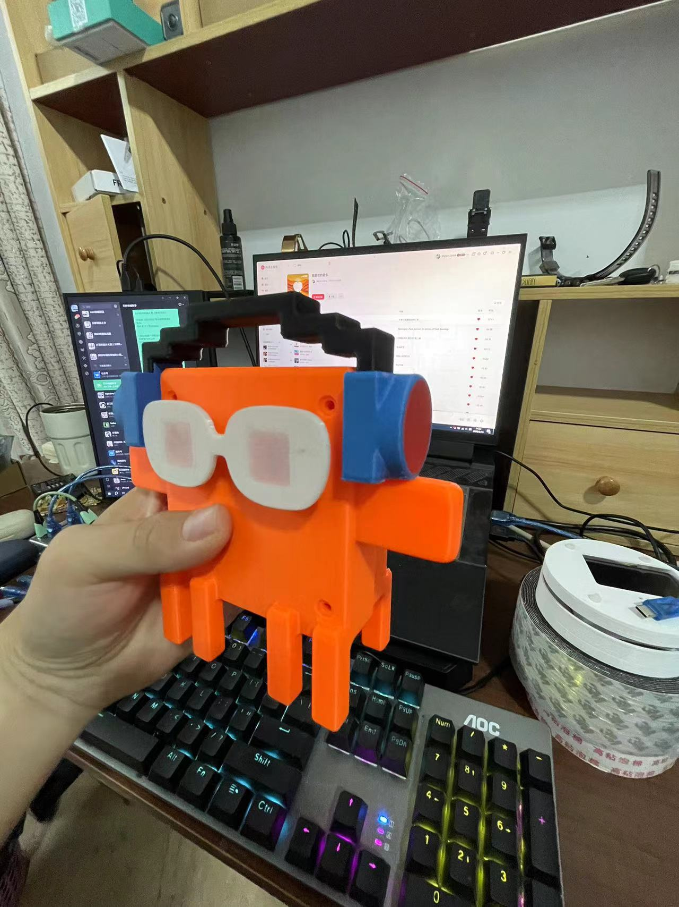 | 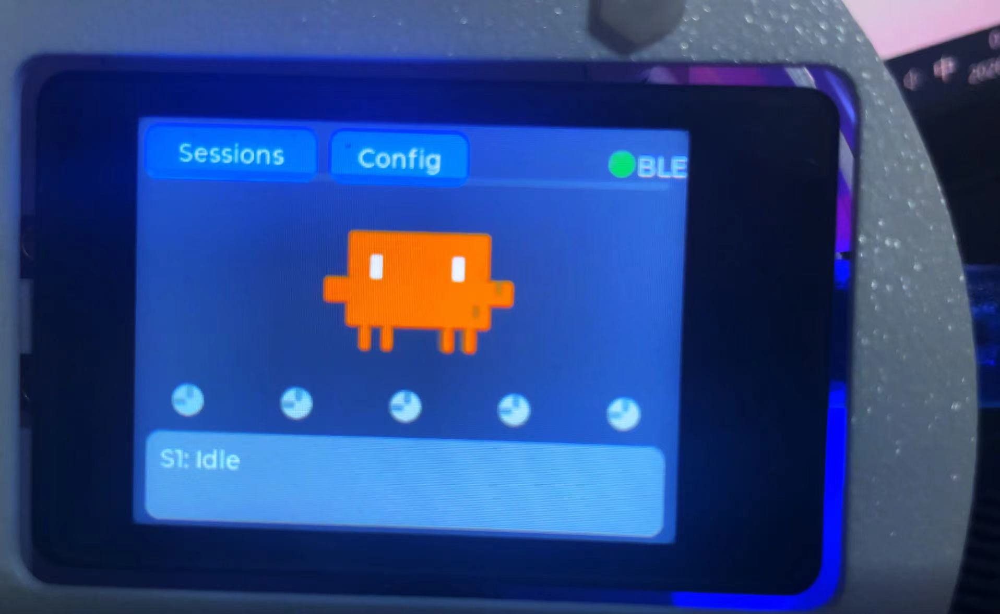 |
| 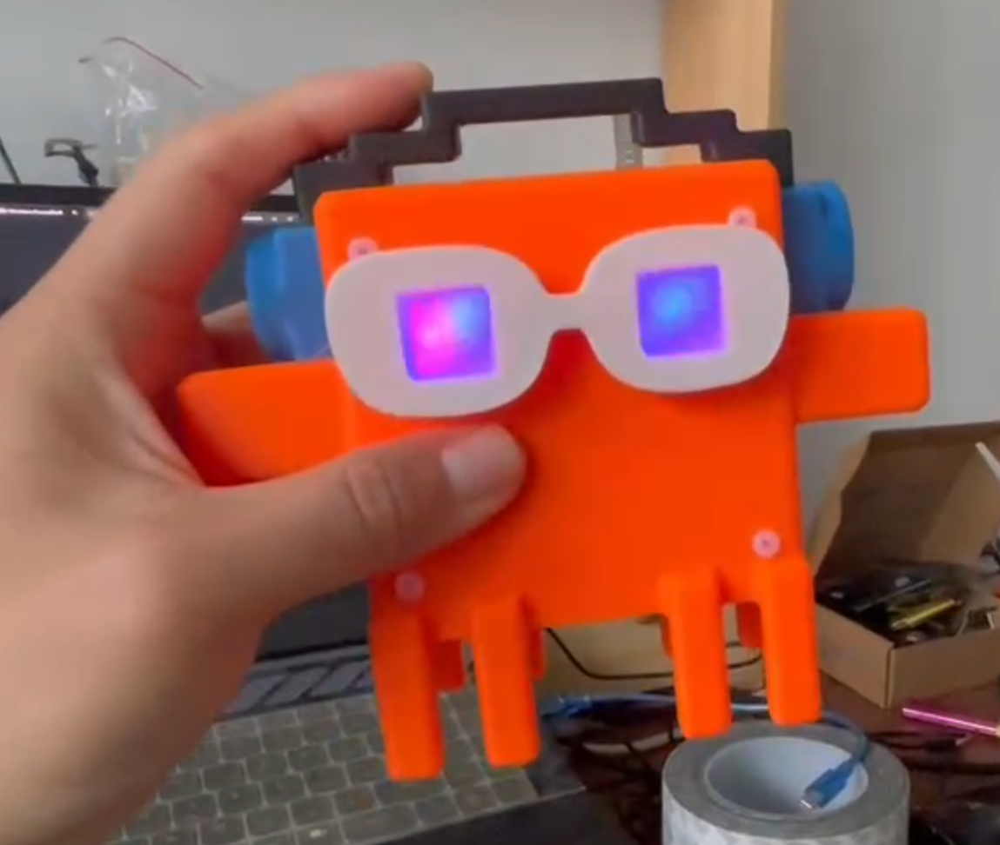 |  |
|  | 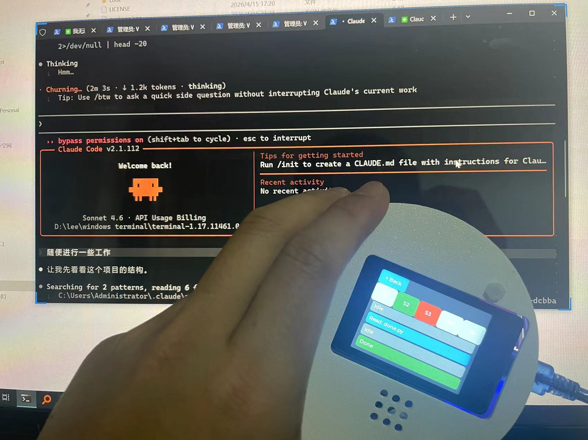 |

### 使用场景实拍
| 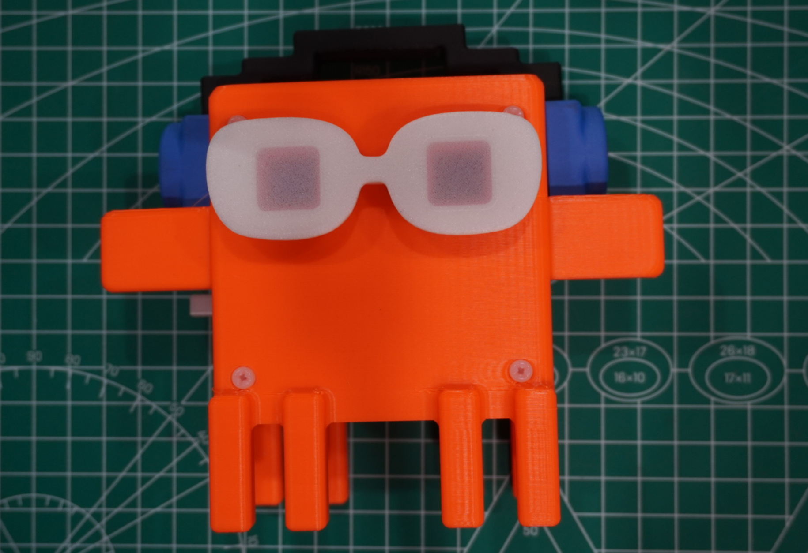 | 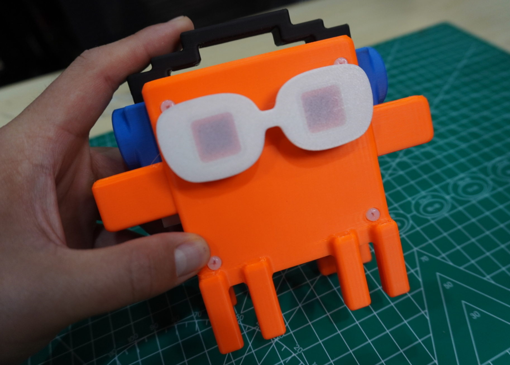 |
| 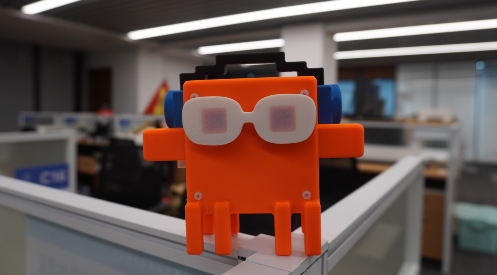 | 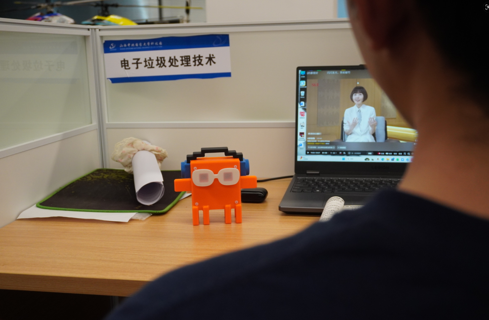 |

---

## 硬件形态

| 形态 | 主控 | 输出 | 特性 |
|------|------|------|------|
| **panel**（状态面板） | ESP32-S3 | ST7789 2.4寸屏 + LVGL + MAX98357A扬声器 | 小人动画 + TTS语音播报 + 多session历史记录 |
| **clock**（闹钟灯） | ESP32-C3 | WS2812×2 + MAX98357A扬声器 | 灯光状态 + TTS语音播报 |

两种形态共用同一份固件代码，`config.py` 中 `VARIANT` 字段区分。

---

## 安装部署

> **推荐：以 Claude Code Plugin 方式安装**（自动注册 hook，无需手动改配置）
>
> ```bash
> claude plugin install claude-buddy
> ```
>
> Plugin 安装后 hook 自动生效。

### 前置要求

**PC端**：
- Python 3.11+
- Windows 10/11（BLE 支持）

**ESP32端**：
- ESP32 已刷入 MicroPython 固件（[官方下载](https://micropython.org/download/)）
- USB 数据线连接 PC

**可选自定义**：
- 修改 `device/config.py` 中 `CHARACTER` 字段切换面板角色（8 种预设：claude/cat/robot/ghost/among_us/creeper/kirby/pikachu）
- 运行 `scripts/gen_voice_assets.py` 自定义语音音色（200+ 豆包音色可选）

---

### 安装 PC 依赖

```bash
pip install -e .
```

### 一键 GUI 烧录配置工具

`setup_tool` 整合了烧录固件、选择角色、生成语音、BLE 配对等全部装机步骤，**一个界面搞定所有操作**。

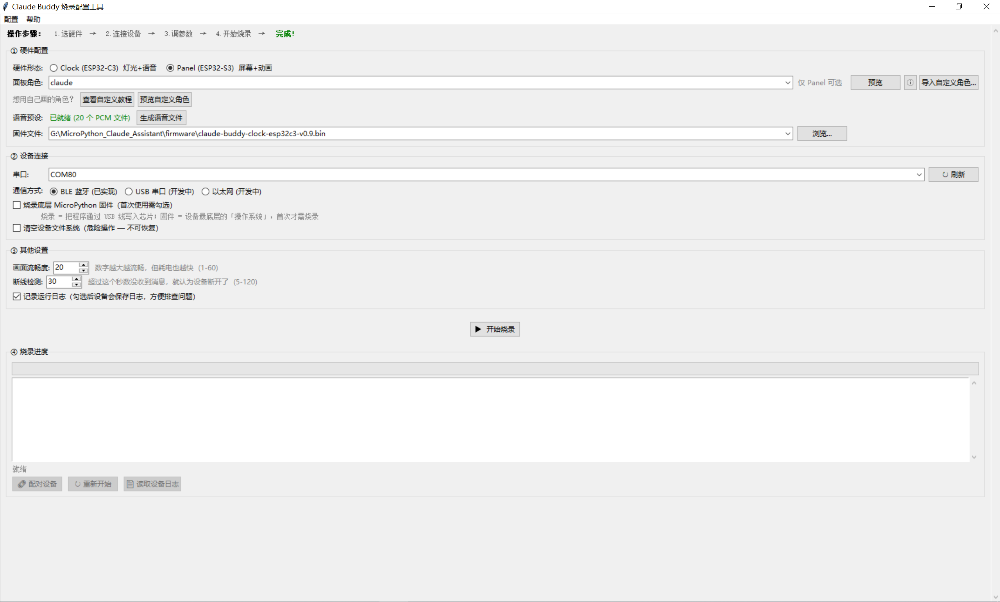

运行 `dist/Claude_Assistant_Setup.exe`（从 Releases 页面下载）。

**图形界面操作步骤**（5 步主流程）：

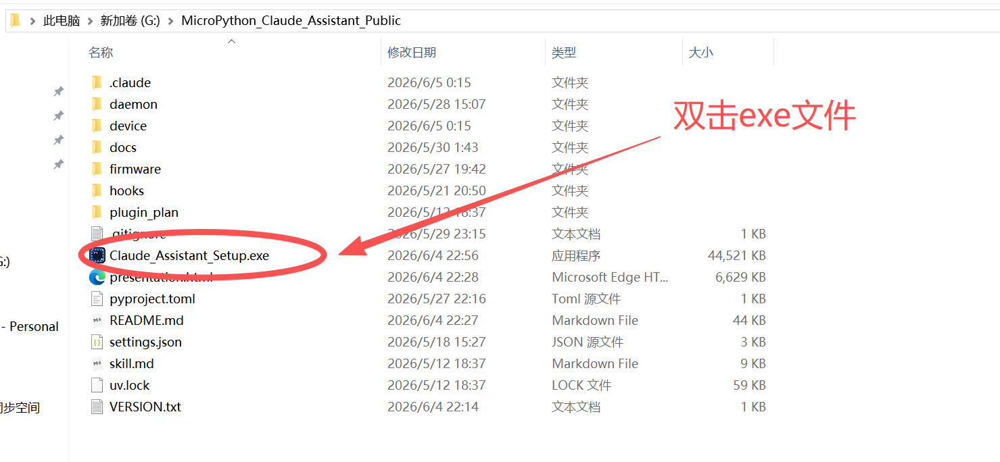 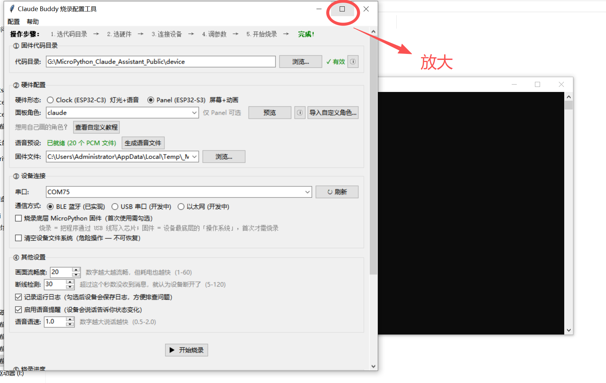 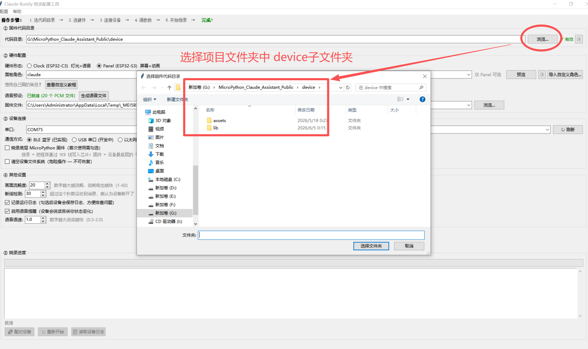 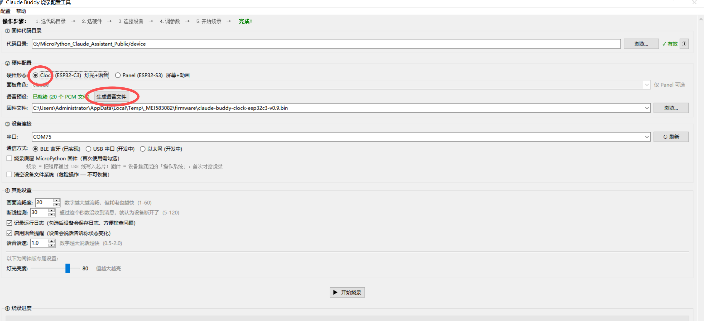

1. **选代码目录**：双击 EXE 启动 → 最大化窗口 → 点击【浏览】选择 `device/` 目录
2. **选硬件**：Clock（ESP32-C3 灯光+语音）/ Panel（ESP32-S3 屏幕+角色动画），Panel 可选 8 种预设角色或导入自定义角色
3. **连设备 + 配置**：USB 连接 ESP32，选择串口；首次使用勾选"烧录底层固件"和"清空文件系统"
4. **开始烧录**：点击按钮，进度条显示实时状态（擦除→烧录→校验→重启）
5. **配对设备**：烧录完成后点击"配对设备"进行 BLE 配对，MAC 地址自动保存

> 完整 25 步截图操作指南（含 Clock/Panel 分叉路径、豆包 TTS 语音生成、自定义角色导入等细节）见 **[setup_tool_guide.md](setup_tool_guide.md)** 或 **[setup_tool_guide_EN.md](setup_tool_guide_EN.md)**。
>
> GUI 工具会自动扫描串口、匹配固件文件、检查依赖，无需手动执行 CLI 步骤。

### 启动守护进程

```bash
python daemon/ble_daemon.py
```

daemon 启动后自动搜索并连接 ESP32，连接成功后设备播放连接语音/动画。

### 验证

```bash
python daemon/smoke.py               # 验证daemon TCP可达（退出码0=正常）
```

smoke 通过后，在 Claude Code 中执行任意工具（如 Read 文件），设备应出现对应灯光/动画。

### 日常使用流程

```
每次使用：
  1. 开机 ESP32 设备（USB供电或电池）
  2. PC 启动 daemon：python daemon/ble_daemon.py
  3. 打开 Claude Code，正常使用即可
  4. 设备自动反映 Claude 工作状态
```

---

## 自定义

### 换语音音色

使用 `scripts/gen_voice_assets.py` 重新生成 PCM 文件，再烧录到设备：

```bash
python scripts/gen_voice_assets.py    # 打开 GUI，选音色/调参数/逐状态生成
```

1. 在豆包[语音控制台](https://console.volcengine.com/speech/service/10007)获取 App ID 和 Access Token
2. GUI 中选择音色（200+ 种可选）、调节语速/语调/音量，逐状态生成
3. 文件自动保存到 `device/assets/`，烧录时一并上传

**空间限制**：ESP32-C3 / ESP32-S3 Flash 有限，每状态建议保留 1-4 个变体，总 PCM ≤ 2MB。

---

### 换面板角色形象（panel 形态）

**方式一：使用预设角色**

修改 `device/config.py` 中的 `CHARACTER` 字段，然后重新烧录：

```python
CHARACTER = "kirby"   # claude / cat / robot / ghost / among_us / creeper / kirby / pikachu
```

**方式二：使用 `/create-character` Skill（推荐）**

在 Claude Code 中输入 `/create-character`，AI 会引导你完成角色创建全流程：

1. **描述需求** — 告诉 AI 想要什么形象（参考图片、文字描述、像素图均可）
2. **AI 生成代码** — 自动创建 `device/char_<name>.py`，含 5 状态配色 + 8 帧摆动动画
3. **自动注册** — 写入 `device/config.py` 的 `CHARACTER` 字段
4. **重新烧录** — 运行 setup_tool 或 `flash_device.py` 即可看到新角色

---

### 调整语音行为参数

编辑 `device/config.py`（烧录时自动生成，修改后需重新烧录）：

```python
VOICE_HISTORY_DEPTH = 10    # 语音上下文历史深度
VOICE_WORK_MIN_S    = 20    # 工作中偶发播报最短间隔（秒）
VOICE_WORK_MAX_S    = 60    # 工作中偶发播报最长间隔（秒）
VOICE_IDLE_MIN_S    = 20    # 空闲偶发播报最短间隔（秒）
VOICE_IDLE_MAX_S    = 60    # 空闲偶发播报最长间隔（秒）
```

修改后重新烧录：运行 setup_tool 重新烧录。

---

## 变更记录

| 版本 | 日期 | 内容 |
|------|------|------|
| v0.10.1 | 2026-06-05 | 双语文档体系 + 25 步图文装机指南 + GUI 烧录工具优化 |
| v0.10.0 | 2026-05-30 | GUI 烧录工具 + 面板语音补齐 + 角色创建 Skill |
| v0.9.0 | 2026-05-18 | MVP 可用：双硬件形态 + 灯光语音完整功能 |

---

> 项目源码和开发者文档，联系 wx:lzs110614011
