# Claude Assistant Setup 图文操作指南

> [🇨🇳 中文](setup_tool_guide.md) · [🇬🇧 English](setup_tool_guide_EN.md)

本指南按步骤截图展示一键烧录配置工具（`Claude_Assistant_Setup.exe` 或 `python -m setup_tool`）的完整操作流程。25 张截图覆盖从启动到日志诊断的全过程，含 **Clock（ESP32-C3 灯光语音）** 和 **Panel（ESP32-S3 屏幕动画）** 两条分叉路径。

---

## 第 1 步：项目根目录，启动安装程序

进入 `MicroPython_Claude_Assistant_Public` 目录（含 `.claude`、`daemon`、`device` 等工程文件夹），双击 `Claude_Assistant_Setup.exe` 启动烧录配置软件。

> `device/` 是后续必须选中的固件代码根目录。

---

## 第 2 步：软件主界面，窗口放大

Claude Buddy 烧录配置工具主界面，分 5 大配置步骤：①选代码 → ②硬件 → ③连设备 → ④参数 → ⑤烧录。点击窗口右上角最大化按钮，展开完整界面方便配置。

---

## 第 3 步：步骤① — 选定固件代码目录

点击代码目录右侧【浏览】按钮，弹窗进入 `device/` 文件夹并选中。选中后输入框右侧出现 **√有效** 标记，文件夹内含 `assets/`（语音资源）、`lib/`（库文件）。

---

## 第 4 步：步骤② — Clock 硬件选型（灯光 + 语音，无屏幕）

单选 **Clock (ESP32-C3)**：灯光 + 语音模式。选中后软件自动匹配 C3 无屏版固件 bin。C3 机型必须提前生成 PCM 语音文件——点击红圈标注的【生成语音文件】按钮进入下一步。

---

## 第 5 步：豆包 PCM 语音生成器 — 密钥校验

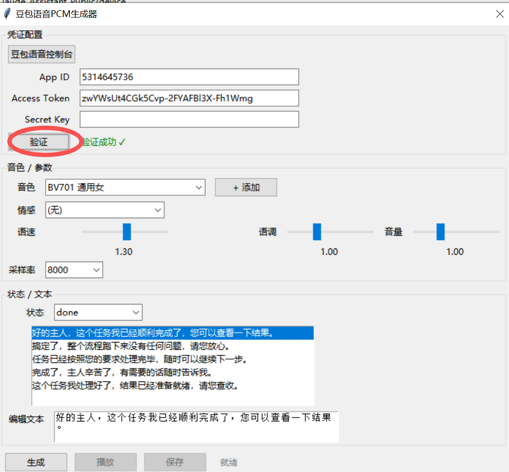

点击"生成语音"后弹出工具窗口。填入豆包开放平台的 App ID 和 Access Token，点击【验证】。提示"验证成功 √"后解锁在线 TTS 合成权限。

> 密钥获取：[豆包语音控制台](https://console.volcengine.com/speech/service/10007)

---

## 第 6 步：语音音色切换

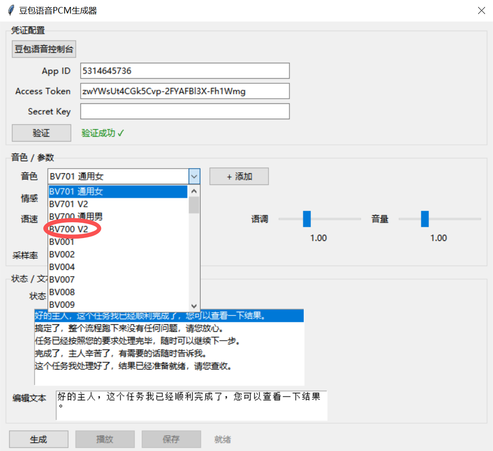

点开音色下拉菜单，内置多种音色可选（默认 BV701 通用女声，也可选 BV700 V2 通用男声等）。同时可调节语速、语调、音量参数。

---

## 第 7 步：语音合成生成

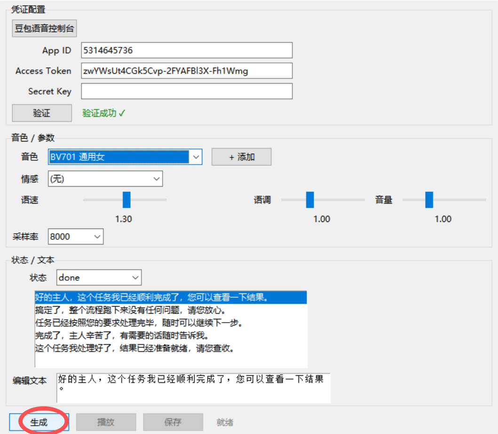

配置好音色、参数、播报文本后，点击左下角【生成】按钮。软件调用豆包接口把文字转为 8000 采样率的硬件专用 PCM 音频。

---

## 第 8 步：合成语音保存路径

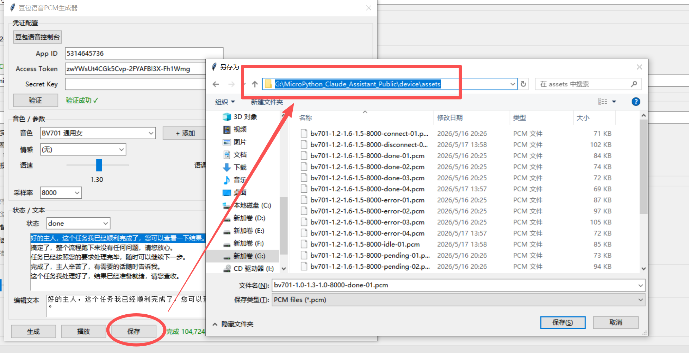

生成完成后点击【保存】，弹窗路径固定选择 `device/assets/` 文件夹。所有播报音频必须存入该目录，烧录时软件自动打包进芯片。

---

## 第 9 步：步骤② — Panel 硬件选型（屏幕 + 角色动画）

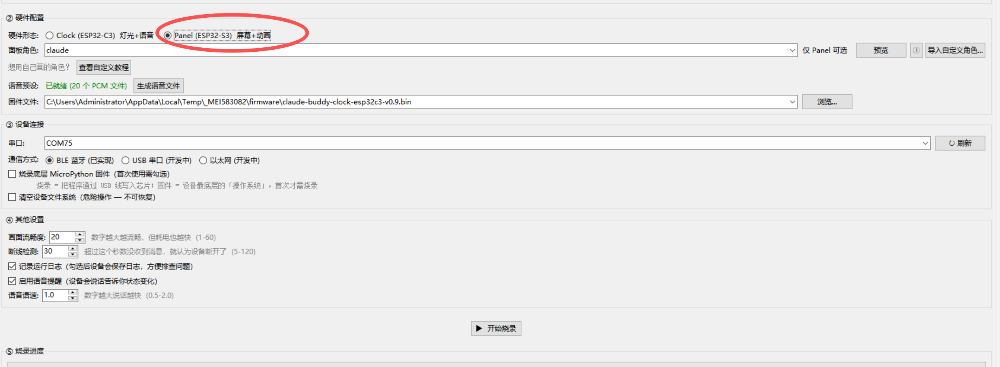

单选 **Panel (ESP32-S3)**：屏幕 + 动画模式，适配带 LCD 显示屏的 S3 开发板。切换后界面新增「面板角色」下拉选项，可用像素角色动画。

---

## 第 10 步：Panel 内置角色列表

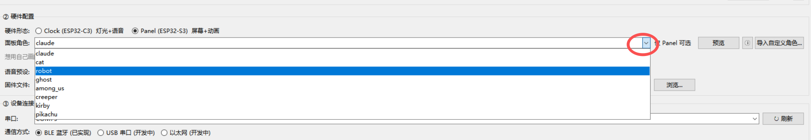

点开「面板角色」下拉框，内置 8 个预设角色：`claude`、`cat`、`robot`、`ghost`、`among_us`、`creeper`、`kirby`、`pikachu`。选中后烧录即可在屏幕显示对应动画。

---

## 第 11 步：内置角色预览

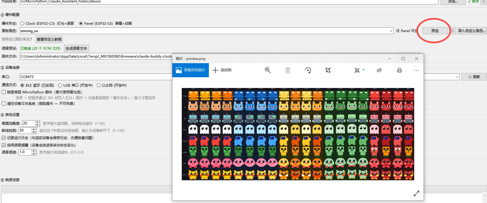

选中面板角色（如 `among_us`），点击【预览】按钮。弹窗展示全角色像素预览图，每行对应一个角色的全部配色动画帧，可提前预览效果。

---

## 第 12 步：导入自定义角色

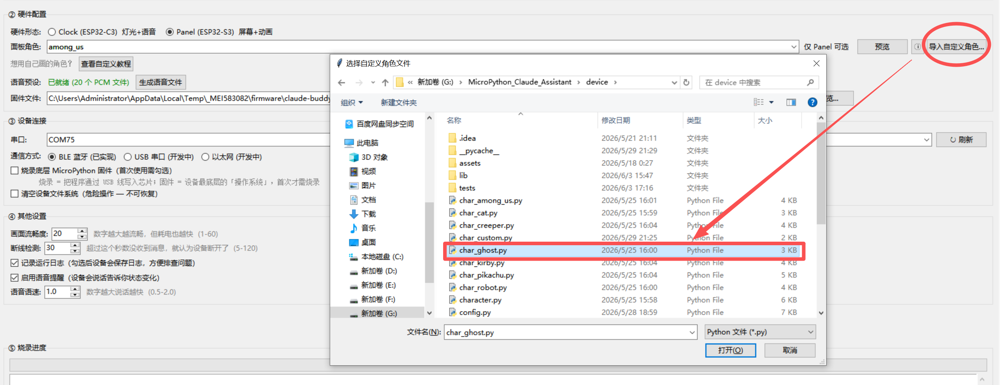

点击右上角【导入自定义角色…】按钮，弹窗进入 `device/` 目录，选中自定义角色源码（如 `char_ghost.py`，幽灵像素角色 Python 脚本）。

---

## 第 13 步：自定义角色导入成功

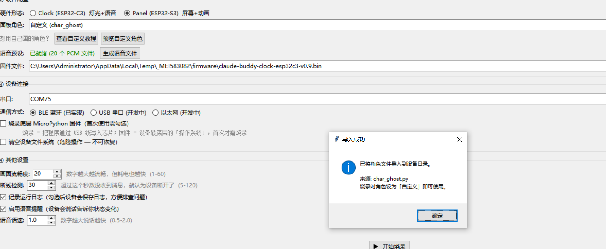

弹窗提示"导入成功，已将角色文件导入设备目录，面板选为「自定义」即可使用"。面板角色自动变更为 `自定义(char_ghost)`，源码已写入工程。

---

## 第 14 步：预览自定义角色

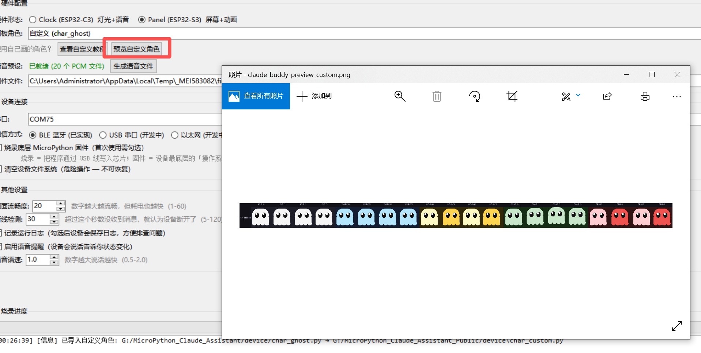

点击【预览自定义角色】按钮，弹窗展示 ghost 幽灵的多配色像素动画帧，校验自定义角色素材解析正常、无贴图缺失。

---

## 第 15 步：固件文件自动匹配

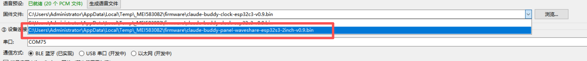

固件下拉框根据硬件选型自动匹配：
- 选 **S3** → `claude-buddy-panel-waveshare-esp32s3-2inch-v0.9.bin`（2 寸屏固件）
- 选 **C3** → C3 无屏固件

固件存储在系统临时缓存目录，无需手动下载。

---

## 第 16 步：串口选择与首次烧录配置

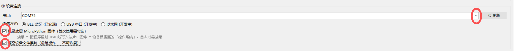

- **串口下拉框**：点击刷新，选择设备的 COM 口（示例 COM75）
- **烧录底层 MicroPython 固件**：全新空白芯片首次必勾选，刷入芯片底层操作系统
- **清空设备文件系统**：首次烧录勾选（全盘格式化闪存，不可恢复），后续升级取消勾选

通信方式默认 BLE 蓝牙（已实现）。

---

## 第 17 步：开始烧录

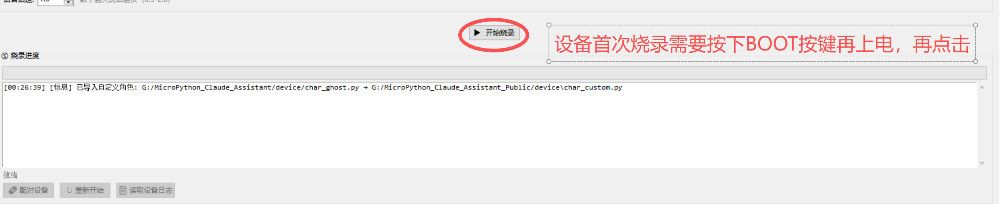

点击【开始烧录】按钮。注意右侧红字提示：设备首次烧录需按下 **BOOT 按键** 再上电，然后点击开始烧录。底部日志区显示各步骤进度。

---

## 第 18 步：固件烧录中（擦除 Flash）

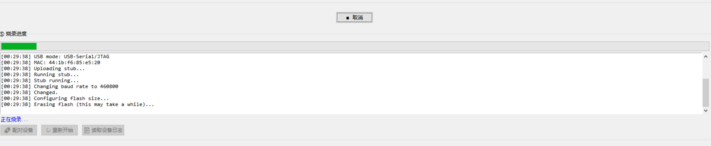

进度条绿色走动，日志显示 `Erasing flash`（擦除闪存）。正在擦除芯片原有数据，**全程不可断开 USB 数据线**。

---

## 第 19 步：固件 100% 烧写完成

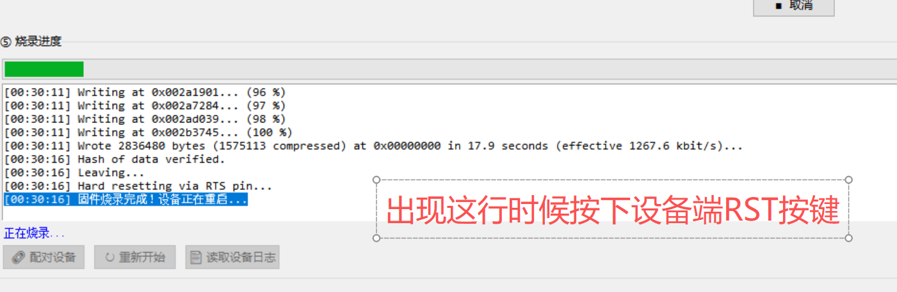

日志显示 100% 写入、Hash 数据校验通过、固件烧录完成。设备正在重启。出现该行提示时，**手动按下设备 RST 复位按键** 重启硬件。

---

## 第 20 步：烧录完成后刷新串口

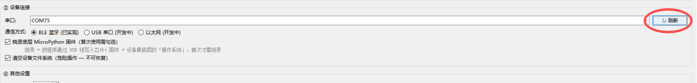

设备 RST 重启上电后，点击串口栏【刷新】按钮重新枚举设备 COM 串口，准备蓝牙配对。

---

## 第 21 步：全部资源烧录完毕

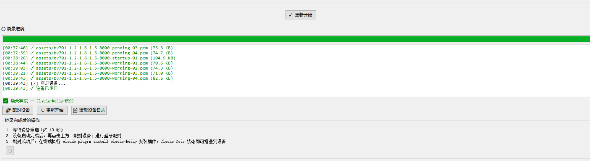

顶部进度条全绿，日志逐条校验 `assets/` 下所有 PCM 语音文件全部 ✅，末尾自动重启设备。左下角显示烧录完成及设备 BLE 名称（如 `Claude-Buddy-E522`）。下方有 3 个功能按钮及 3 步配对操作指引。

---

## 第 22 步：配对设备入口

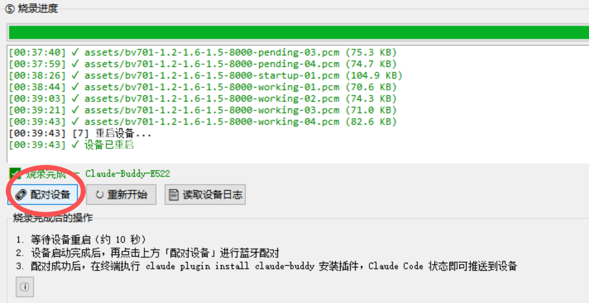

点击左下角【配对设备】按钮，这是打开 BLE 蓝牙扫描窗口的唯一入口。需等待设备开机、蓝牙广播开启后再点击。

---

## 第 23 步：BLE 设备配对 — 开始扫描

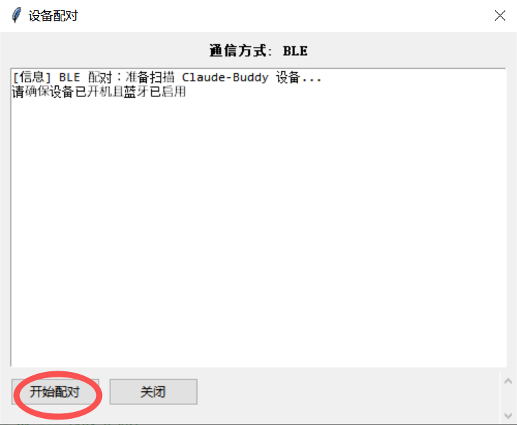

弹窗标题"设备配对 - BLE 低功耗蓝牙"，提示确保设备已开机启用蓝牙。点击【开始配对】按钮，软件开启 5 秒蓝牙扫描。

---

## 第 24 步：蓝牙配对成功

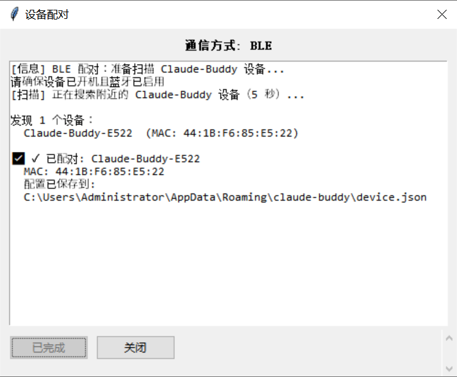

扫描到硬件设备（如 `Claude-Buddy-E522` + MAC 地址 `44:1B:F6:85:E5:22`），显示"已配对"。配对配置自动保存到电脑本地 JSON 配置文件，按钮变为「已完成」。

---

## 第 25 步：读取设备运行日志

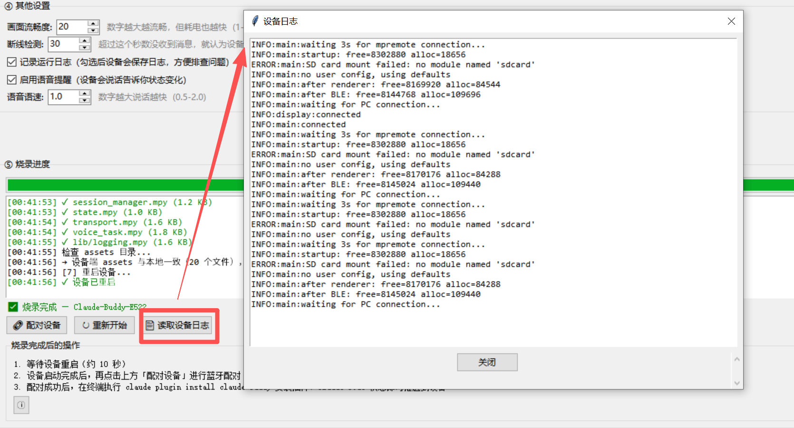

点击【读取设备日志】按钮（仅配对成功后可用），弹窗输出设备开机运行日志：

- `INFO`：启动内存、屏幕、蓝牙初始化正常
- `ERROR: SD card mount failed`：未插 TF 存储卡，属正常报错无需处理

该功能用于日常调试、查看设备运行故障。

---

## 操作速查

| 场景 | 关键步骤 | 对应截图 |
|------|---------|---------|
| **首次烧录 Clock** | 1→2→3→4→5→6→7→8→16→17→18→19→20→21→22→23→24 | exe1~8, exe16~24 |
| **首次烧录 Panel** | 1→2→3→9→10→(可选11~14)→15→16→17→18→19→20→21→22→23→24 | exe1~3, exe9~24 |
| **升级固件（Clock/Panel）** | 1→2→3→4/9→16(取消勾选底层固件+清空)→17→18→19→20→21 | 跳过 exe5~8 |
| **仅换角色（Panel）** | 1→2→3→9→10→16(仅勾选参数调整)→17 | 跳过固件烧录 |
| **查看设备日志** | 启动软件→24→配对→25 | exe24~25 |

> **提示**：首次烧录必须勾选"烧录底层 MicroPython 固件"和"清空设备文件系统"；后续升级取消这两个勾选，仅上传应用代码。
