# Claude Assistant Setup 图文操作指南

> [🇨🇳 中文](setup_tool_guide.md) · [🇬🇧 English](setup_tool_guide_EN.md)

本指南按步骤截图展示一键烧录配置工具（`Claude_Assistant_Setup.exe` 或 `python -m setup_tool`）的完整操作流程。覆盖从启动到桥接诊断的全过程，含 **D-Shell（ESP32-S3 正式面板，触摸屏+灯带）**、**Panel（ESP32-S3 开发板，屏幕动画）**、**Clock（ESP32-C3 灯光语音）** 和 **WizFi360（RP2040 + WiFi，TCP 通信）** 四条分叉路径。

---

## 第 1 步：项目根目录，启动安装程序

进入 `MicroPython_Claude_Assistant_Public` 目录（含 `.claude`、`daemon`、`device` 等工程文件夹），双击 `Claude_Assistant_Setup.exe` 启动烧录配置软件。

> `device/` 是后续必须选中的固件代码根目录。

---

## 第 2 步：软件主界面，窗口放大

Claude Buddy 烧录配置工具主界面，分 5 大配置步骤：①选代码 → ②硬件 → ③连设备 → ④参数 → ⑤烧录。点击窗口右上角最大化按钮，展开完整界面方便配置。

---

## 第 3 步：步骤① — 选定固件代码目录

点击代码目录右侧【浏览】按钮，弹窗进入 `device/` 文件夹并选中。选中后输入框右侧出现 **√有效** 标记，文件夹内含 `assets/`（语音资源）、`lib/`（库文件）。

---

## 第 3a 步：步骤② — WizFi360 硬件选型（RP2040 + WiFi TCP 通信）

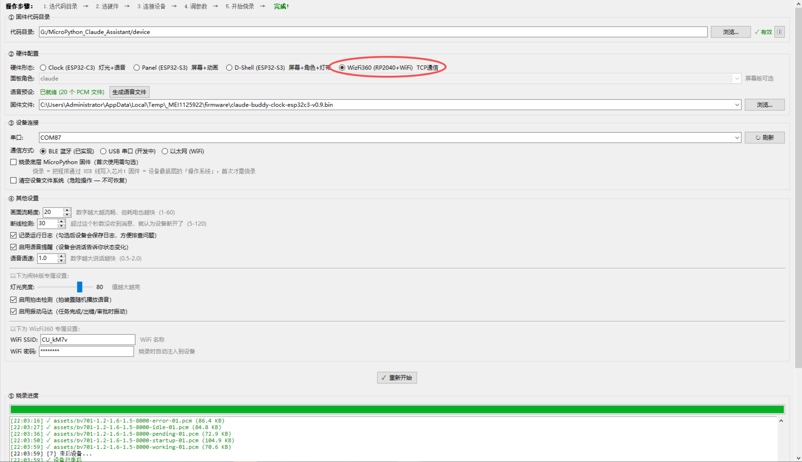

单选 **WizFi360 (RP2040+WiFi)**：基于 WizFi360-EVB-Pico 开发板，通过 WiFi TCP 与 PC 通信（无需蓝牙）。选中后下方出现 WiFi 配置区域，填入路由器的 **SSID（WiFi 名称）** 和 **密码**，烧录时自动注入到设备。

> WizFi360 使用 RP2040 主控，通过 AT 指令控制 WizFi360 WiFi 模块。通信方式自动切换为「以太网 (WiFi)」。

---

## 第 3b 步：步骤③ — 选择以太网 (WiFi) 通信方式

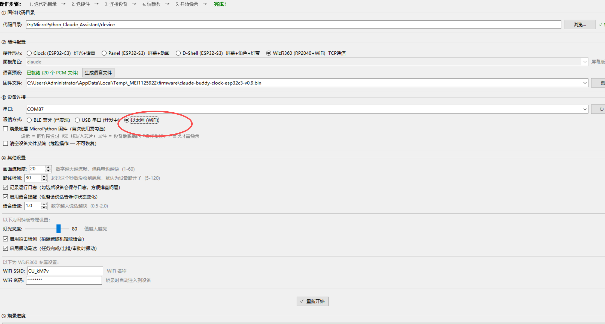

选择 WizFi360 后，设备连接区域的通信方式自动切换为 **以太网 (WiFi)**。烧录完成后 PC 通过 TCP 连接设备（默认端口 57321），无需 BLE 蓝牙配对。

> PC 端会自动扫描局域网空闲 IP 并分配静态 IP 给设备，确保每次连接 IP 固定不变。

---

## 第 4 步：步骤② — Clock 硬件选型（灯光 + 语音，无屏幕）

单选 **Clock (ESP32-C3)**：灯光 + 语音模式。选中后软件自动匹配 C3 无屏版固件 bin。C3 机型必须提前生成 PCM 语音文件——点击红圈标注的【生成语音文件】按钮进入下一步。

---

## 第 5 步：豆包 PCM 语音生成器 — 密钥校验

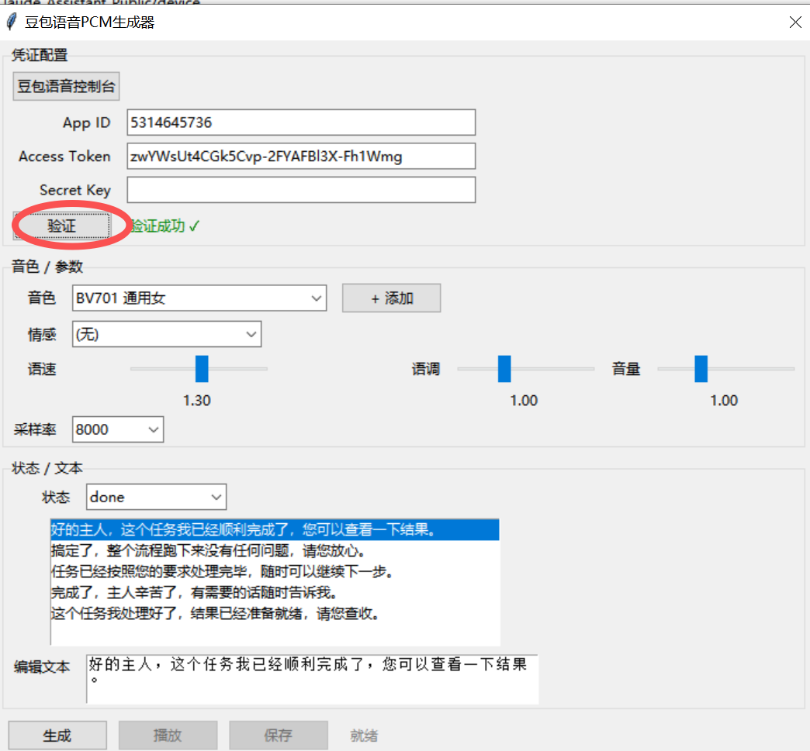

点击"生成语音"后弹出工具窗口。填入豆包开放平台的 App ID 和 Access Token，点击【验证】。提示"验证成功 √"后解锁在线 TTS 合成权限。

> 密钥获取：[豆包语音控制台](https://console.volcengine.com/speech/service/10007)

---

## 第 6 步：语音音色切换

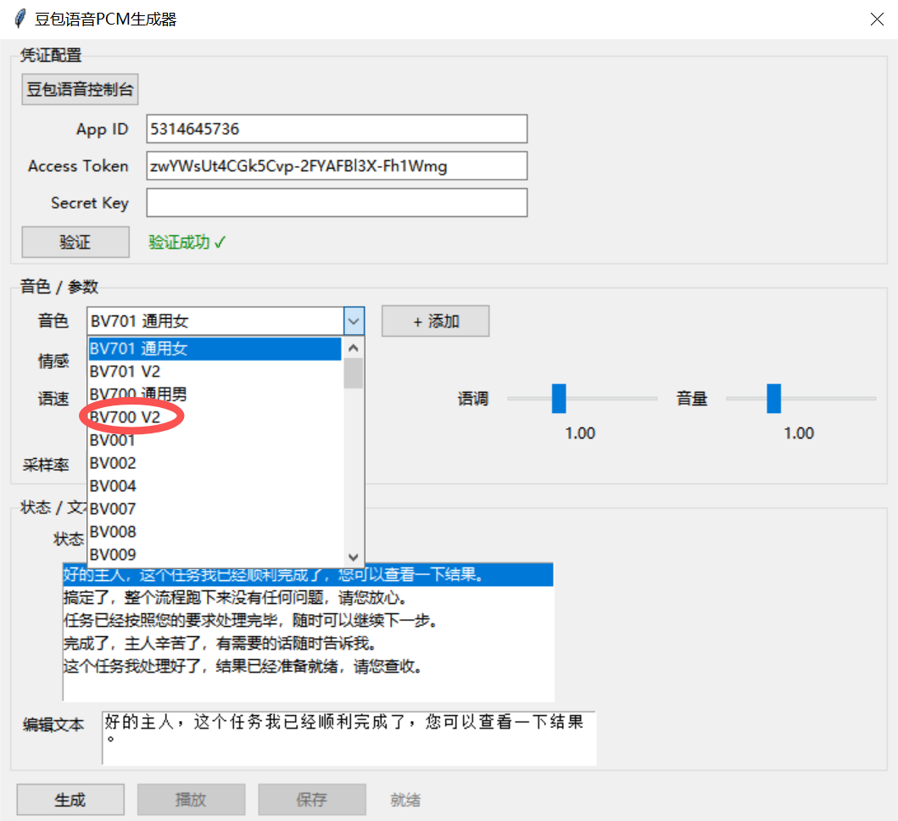

点开音色下拉菜单，内置多种音色可选（默认 BV701 通用女声，也可选 BV700 V2 通用男声等）。同时可调节语速、语调、音量参数。

---

## 第 7 步：语音合成生成

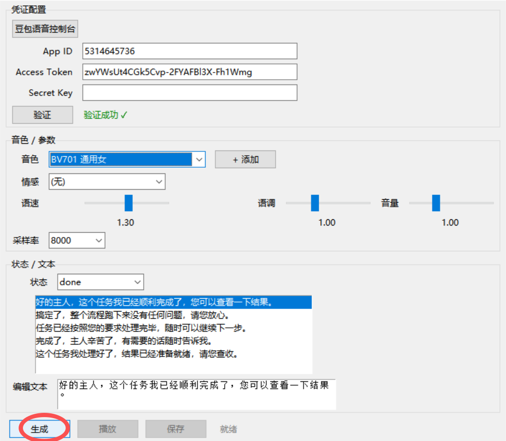

配置好音色、参数、播报文本后，点击左下角【生成】按钮。软件调用豆包接口把文字转为 8000 采样率的硬件专用 PCM 音频。

---

## 第 8 步：合成语音保存路径

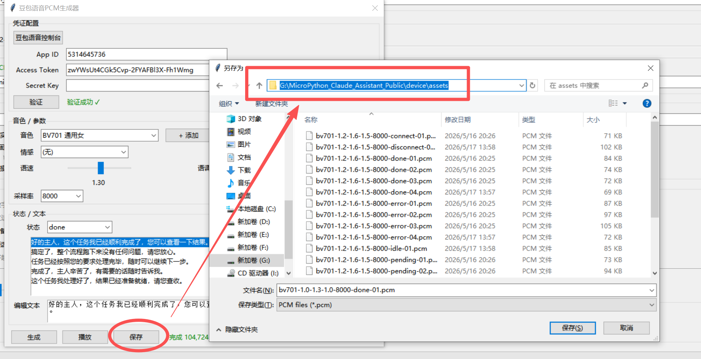

生成完成后点击【保存】，弹窗路径固定选择 `device/assets/` 文件夹。所有播报音频必须存入该目录，烧录时软件自动打包进芯片。

---

## 第 9 步：步骤② — 屏幕版硬件选型（Panel / D-Shell）

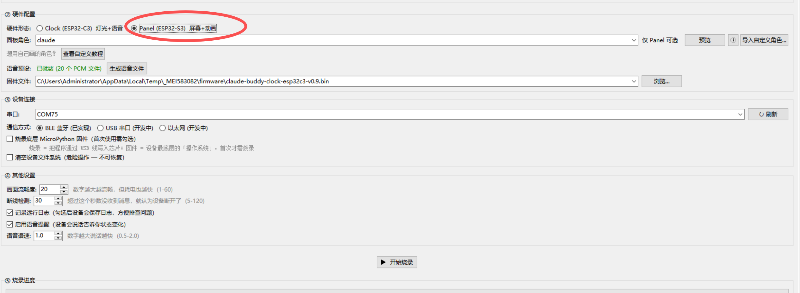

屏幕版有两个选项，均适配 ESP32-S3 带 LCD 显示屏机型：

- **D-Shell (ESP32-S3)  屏幕+角色+灯带**：正式面板硬件，GT911 触摸屏 + WS2812×8 彩虹灯带，切换后同样可选面板角色。
- **Panel (ESP32-S3)  屏幕+动画**：Waveshare 开发板，CST816S 触摸屏。切换后界面新增「面板角色」下拉选项，可用像素角色动画。

---

## 第 10 步：屏幕版内置角色列表

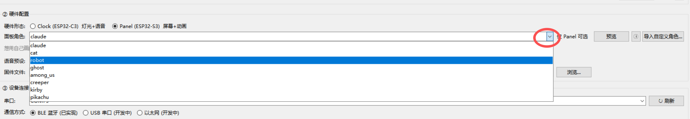

点开「面板角色」下拉框（Panel / D-Shell 均可使用），内置 8 个预设角色：`claude`、`cat`、`robot`、`ghost`、`among_us`、`creeper`、`kirby`、`pikachu`。选中后烧录即可在屏幕显示对应动画。

---

## 第 11 步：内置角色预览

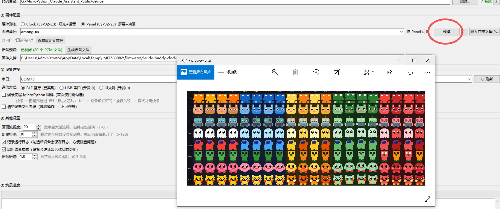

选中面板角色（如 `among_us`），点击【预览】按钮。弹窗展示全角色像素预览图，每行对应一个角色的全部配色动画帧，可提前预览效果。

---

## 第 12 步：导入自定义角色

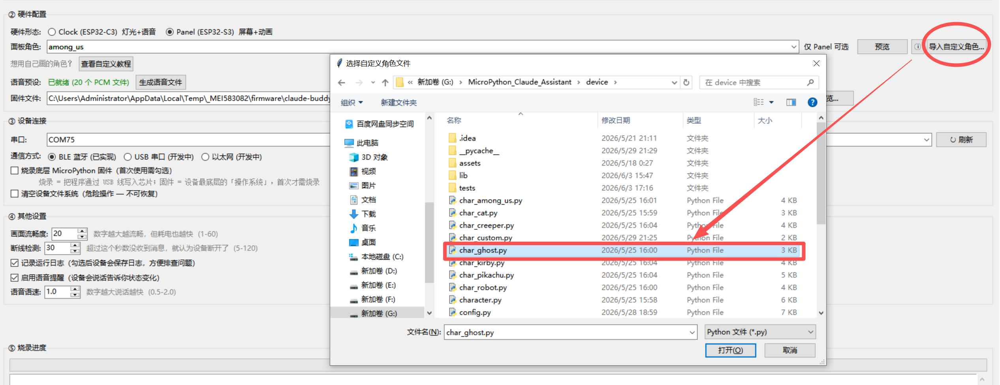

点击右上角【导入自定义角色…】按钮，弹窗进入 `device/` 目录，选中自定义角色源码（如 `char_ghost.py`，幽灵像素角色 Python 脚本）。

---

## 第 13 步：自定义角色导入成功

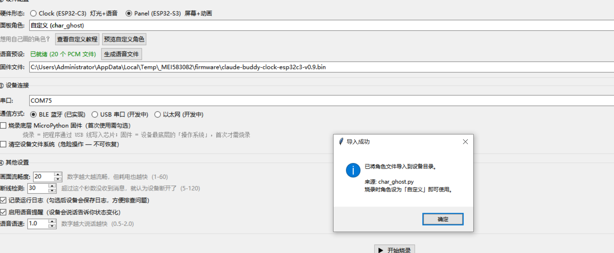

弹窗提示"导入成功，已将角色文件导入设备目录，面板选为「自定义」即可使用"。面板角色自动变更为 `自定义(char_ghost)`，源码已写入工程。

---

## 第 14 步：预览自定义角色

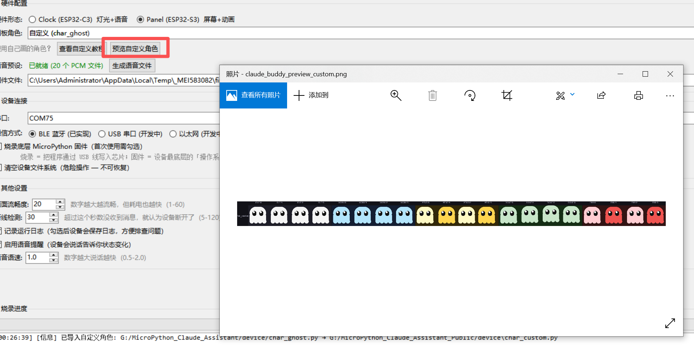

点击【预览自定义角色】按钮，弹窗展示 ghost 幽灵的多配色像素动画帧，校验自定义角色素材解析正常、无贴图缺失。

---

## 第 15 步：固件文件自动匹配

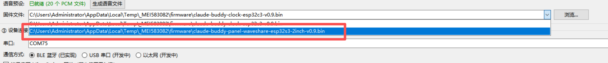

固件下拉框根据硬件选型自动匹配：
- 选 **D-Shell (S3 正式面板)** → `claude-buddy-dshell-esp32s3-v0.9.bin`（GT911 触摸 + 灯带固件）
- 选 **Panel (S3 开发板)** → `claude-buddy-panel-waveshare-esp32s3-2inch-v0.9.bin`（CST816S 触摸固件）
- 选 **Clock (C3)** → `claude-buddy-clock-esp32c3-v0.9.bin`（C3 无屏固件）
- 选 **WizFi360 (RP2040)** → `claude-buddy-clock-wizfi360-v0.9.uf2`（RP2040 拖拽烧录固件）

固件存储在系统临时缓存目录，无需手动下载。

---

## 第 16 步：串口选择与首次烧录配置

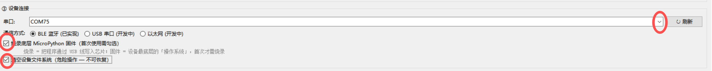

- **串口下拉框**：点击刷新，选择设备的 COM 口（示例 COM75）
- **烧录底层 MicroPython 固件**：全新空白芯片首次必勾选，刷入芯片底层操作系统
- **清空设备文件系统**：首次烧录勾选（全盘格式化闪存，不可恢复），后续升级取消勾选

通信方式默认 BLE 蓝牙（已实现）。选择 WizFi360 后自动切换为「以太网 (WiFi)」。

> **WizFi360 注意**：WizFi360 使用 RP2040 主控，GUI 工具中"烧录底层固件"对 WizFi360 跳过 esptool 步骤（RP2040 出厂已自带 MicroPython）。如需手动刷入 .uf2 固件，按住 **BOOTSEL** 接 USB → 拖入 .uf2 到 RPI-RP2 磁盘 → 自动重启。

---

## 第 17 步：开始烧录

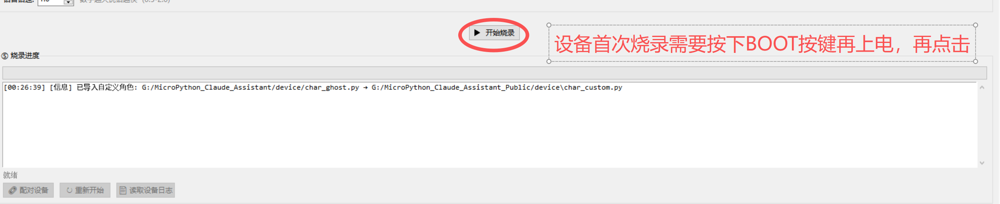

点击【开始烧录】按钮。注意右侧红字提示：设备首次烧录需按下 **BOOT 按键**（ESP32）/ **BOOTSEL 按键**（RP2040）再上电，然后点击开始烧录。底部日志区显示各步骤进度。

---

## 第 18 步：固件烧录中（擦除 Flash）

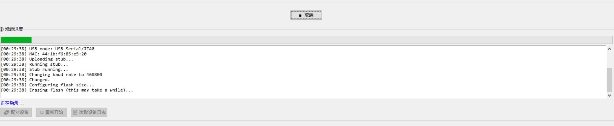

进度条绿色走动，日志显示 `Erasing flash`（擦除闪存）。正在擦除芯片原有数据，**全程不可断开 USB 数据线**。

---

## 第 19 步：固件 100% 烧写完成

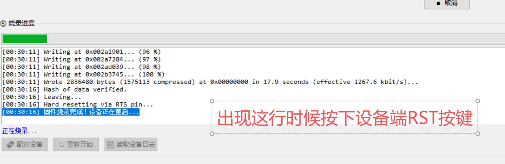

日志显示 100% 写入、Hash 数据校验通过、固件烧录完成。设备正在重启。出现该行提示时，**手动按下设备 RST 复位按键** 重启硬件（WizFi360/RP2040 使用 .uf2 拖拽烧录后自动重启，无需手动复位）。

---

## 第 20 步：烧录完成后刷新串口

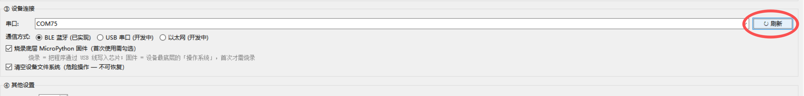

设备 RST 重启上电后，点击串口栏【刷新】按钮重新枚举设备 COM 串口，准备蓝牙配对。

---

## 第 21 步：全部资源烧录完毕

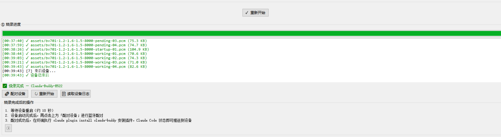

顶部进度条全绿，日志逐条校验 `assets/` 下所有 PCM 语音文件全部 ✅，末尾自动重启设备。左下角显示烧录完成及设备 BLE 名称（如 `Claude-Buddy-E522`）。下方有 3 个功能按钮及 3 步配对操作指引。

---

## 第 22 步：配对设备入口

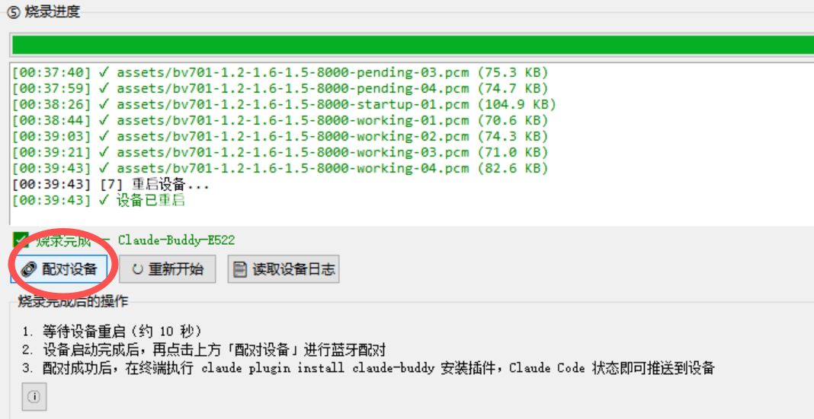

点击左下角【配对设备】按钮，这是打开 BLE 蓝牙扫描窗口的唯一入口。需等待设备开机、蓝牙广播开启后再点击。

---

## 第 23 步：BLE 设备配对 — 开始扫描

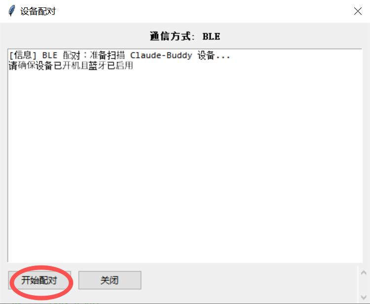

弹窗标题"设备配对 - BLE 低功耗蓝牙"，提示确保设备已开机启用蓝牙。点击【开始配对】按钮，软件开启 5 秒蓝牙扫描。

---

## 第 24 步：蓝牙配对成功

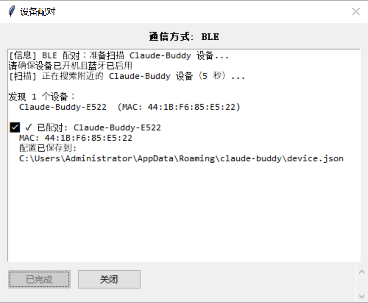

扫描到硬件设备（如 `Claude-Buddy-E522` + MAC 地址 `44:1B:F6:85:E5:22`），显示"已配对"。配对配置自动保存到电脑本地 JSON 配置文件，按钮变为「已完成」。

---

## 第 25 步：读取设备运行日志

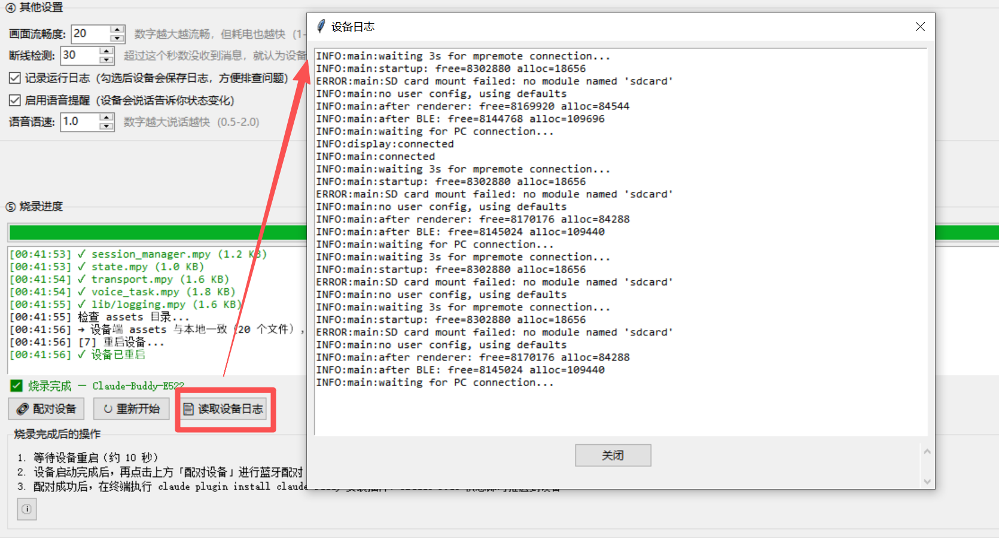

点击【读取设备日志】按钮（仅配对成功后可用），弹窗输出设备开机运行日志：

- `INFO`：启动内存、屏幕、蓝牙初始化正常
- `ERROR: SD card mount failed`：未插 TF 存储卡，属正常报错无需处理

该功能用于日常调试、查看设备运行故障。

---

## 第 22w 步：WiFi TCP 配对 — 输入设备 IP

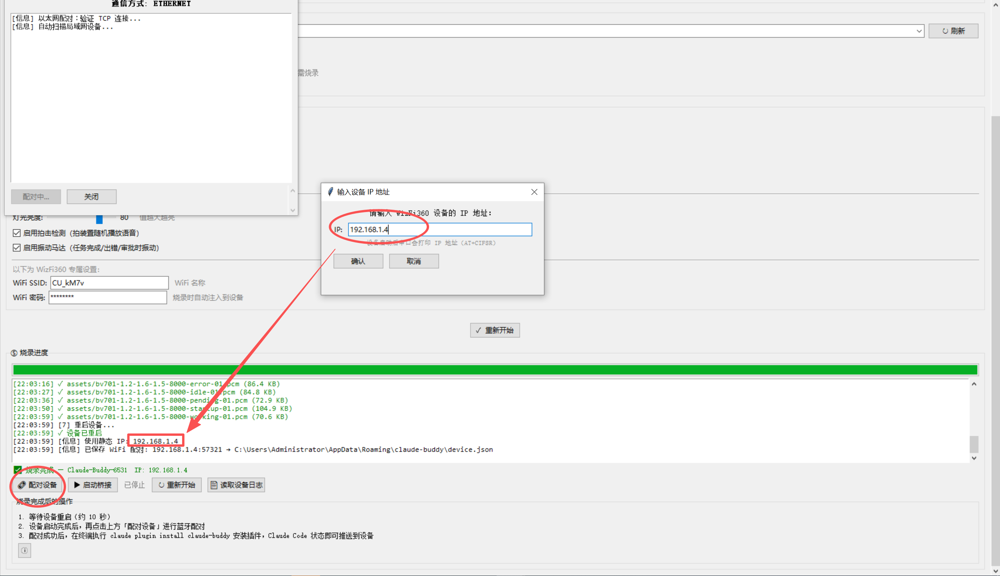

WizFi360 形态烧录完成后，点击【配对设备】按钮。对话框自动扫描局域网找到设备，或手动输入设备 IP 地址（设备启动后串口会打印 IP）。点击确认后 TCP 连接验证通过，配对配置保存到 PC 本地。

> 与 BLE 配对不同，WiFi 配对走 TCP 连接验证，无需蓝牙扫描。

---

## 第 23w 步：静态 IP 确认 — 配对配置已保存

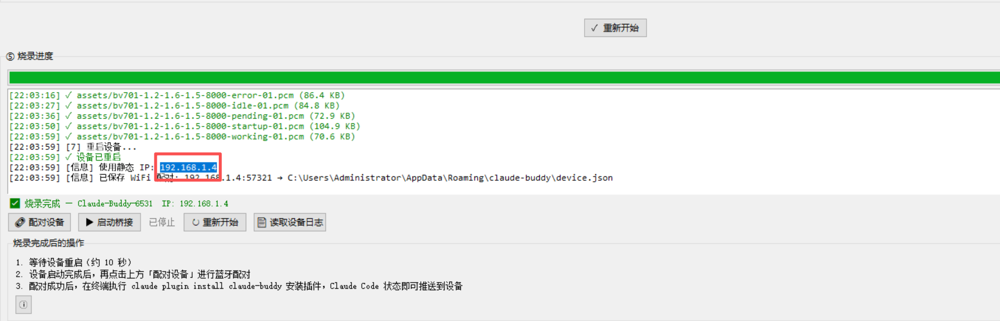

烧录过程中 PC 自动扫描局域网空闲 IP（如 ）并注入设备端静态 IP，配对完成后左下角状态栏显示设备名称和分配的 IP 地址。

> 静态 IP 确保设备每次重启后 IP 不变，桥接无需重新配对。如需更换 IP，重新烧录即可。

---

## 第 26 步：启动桥接（所有形态通用）

烧录和配对完成后，点击【启动桥接】按钮。GUI 内嵌的守护进程在后台运行，连接设备并通过 TCP 端口  接收 Claude Code Hook 推送的状态数据，实时转发到设备端（5Hz 刷新）。

- **BLE 形态**（panel/dshell/clock）：桥接通过 BLE 蓝牙连接设备
- **WiFi 形态**（wizfi360）：桥接通过 TCP（端口 57321）连接设备
- 状态指示灯显示当前桥接运行状态和活跃 session 数量
- 点击【停止桥接】可随时断开连接
- 关闭 GUI 窗口时自动停止桥接

> 桥接启动后，在 Claude Code 中执行任意工具操作，设备端即出现对应灯光/语音/动画反馈。

---

## 操作速查

| 场景 | 关键步骤 | 对应截图 |
|------|---------|---------|
| **首次烧录 Clock** | 1→2→3→4→5→6→7→8→16→17→18→19→20→21→22→23→24→26 | exe1~8, exe16~24, gui_daemen |
| **首次烧录 Panel/D-Shell** | 1→2→3→9→10→(可选11~14)→15→16→17→18→19→20→21→22→23→24→26 | exe1~3, exe9~24, gui_daemen |
| **首次烧录 WizFi360** | 1→2→3→3a→3b→16→17→18→19→20→21→22w→23w→26 | exe1~3, chosee_wifi, chosee_wifi2, exe16~21, pair_wifi, static_ip, gui_daemen |
| **升级固件（Clock/Panel）** | 1→2→3→4/9→16(取消勾选底层固件+清空)→17→18→19→20→21 | 跳过 exe5~8 |
| **仅换角色（Panel）** | 1→2→3→9→10→16(仅勾选参数调整)→17 | 跳过固件烧录 |
| **查看设备日志** | 启动软件→24→配对→25 | exe24~25 |
| **启动桥接（所有形态）** | 已完成配对→点击【启动桥接】→观察状态指示 | gui_daemen |

> **提示**：首次烧录必须勾选"烧录底层 MicroPython 固件"和"清空设备文件系统"；后续升级取消这两个勾选，仅上传应用代码。
